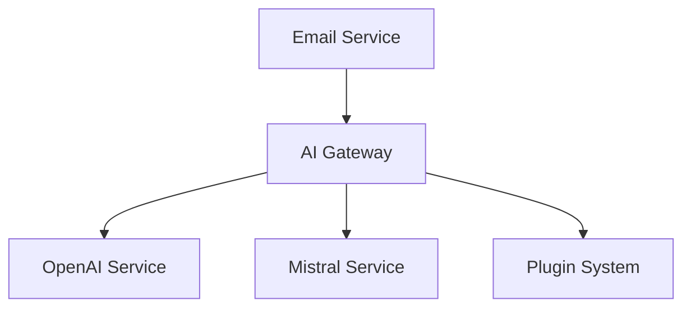

# Mailai - AI Email Assistant

Mailai is a personal automated service that uses artificial intelligence to respond to unread emails. It supports multiple AI providers and offers extensive customization through its plugin system.

## 🚀 Key Features

- Multi-persona email management
- Multiple AI provider support (OpenAI, Mistral, etc.)
- Secure IMAP/SMTP handling
- Plugin system for extensibility
- Real-time monitoring dashboard
- Rate limiting and cooldown periods
- Debug mode for testing
- BCC copying for response monitoring

## 🎭 Multi-Persona Configuration

Mailai supports multiple personas, allowing the AI to respond differently based on different roles or contexts. Configure personas using environment variables:

```env
# Single Persona Example
MAILAI_PERSONA_personal=Personal Assistant
MAILAI_personal_EMAIL_USER=your@email.com
MAILAI_personal_EMAIL_PASSWORD=app-password
MAILAI_personal_PROMPT=personal_prompt.txt

# Multi-Persona Example
MAILAI_PERSONA_work=Work Assistant
MAILAI_work_EMAIL_USER=work@company.com
MAILAI_work_EMAIL_PASSWORD=app-password
MAILAI_work_PROMPT=work_prompt.txt
```

## 🏗️ Technical Architecture

### Module System
Mailai uses CommonJS module system throughout the codebase:
- All modules use `require()` for imports
- Modules export using `module.exports`
- ES6 module syntax (import/export) is not used

### Core Components



1. **Email Service**
- IMAP monitoring for incoming emails
- SMTP for sending responses
- Multi-persona support

2. **AI Gateway**
- Abstract interface for AI providers
- Context management
- Response formatting

3. **Plugin System**
- Hook-based architecture
- Pre/post processing
- Error handling

## 📧 Email Configuration

### Gmail Setup
1. Enable 2-Step Verification
2. Create App Password
3. Configure in `.env`:
```env
MAILAI_EMAIL_USER=your-email@gmail.com
MAILAI_EMAIL_PASSWORD=your-16-char-app-password
MAILAI_EMAIL_HOST=imap.gmail.com
MAILAI_EMAIL_PORT=993
```

## 🔧 Development

### Local Setup
```bash
git clone https://github.com/JeanHuguesRobert/Mailai
cd Mailai
npm install
node index.js
```

### Plugin Development
Create plugins in `plugins/enabled/`:
```javascript
const { MailAIPlugin } = require('../base');

class MyPlugin extends MailAIPlugin {
  async beforeProcessEmail(emailData) {
    return emailData;
  }

  async afterProcessEmail(emailData, response) {
    return response;
  }
}

module.exports = MyPlugin;
```
