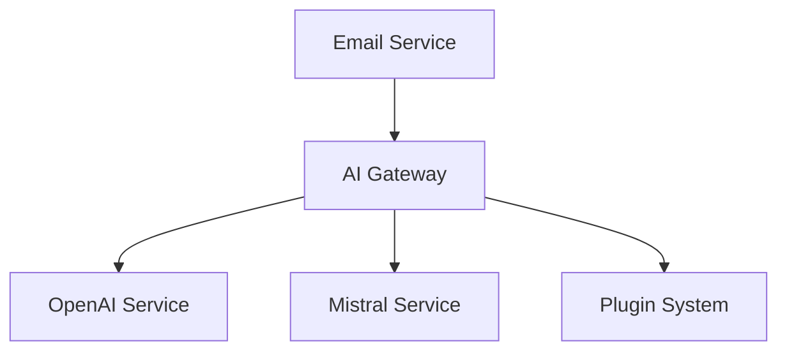

# Mailai - AI Email Assistant

Mailai is your intelligent email management solution that automates email responses using AI. Perfect for:

- **Professional Teams**: Handle client inquiries, support tickets, and general correspondence with consistent, AI-powered responses
- **Small Businesses**: Provide 24/7 email support without dedicated staff
- **Personal Use**: Manage multiple email accounts with different personas (e.g., work, personal, volunteer)
- **Temporary Absence**: Set up auto-responses that are more intelligent than traditional "out of office" replies
- **Email Triage**: Process and categorize incoming emails automatically
- **Multi-Language Support**: Respond to emails in multiple languages using AI capabilities

## 🚀 Key Features

- Multi-persona email management with different AI configurations per role
- Multiple AI provider support (OpenAI, Mistral, Claude, etc.)
- Secure IMAP/SMTP handling with app-specific passwords
- Plugin system for easy extensibility
- Real-time monitoring dashboard
- Rate limiting and cooldown periods
- Multiple operation modes (development, production, testing, dry-run)
- BCC copying for response monitoring
- Detailed logging with mode-specific outputs

## 🎭 Multi-Persona Configuration

Mailai supports multiple personas, allowing different AI configurations for different roles or contexts:

```env
# Core Settings (always uppercase)
MAILAI_MODE=development        # Options: development, production, testing, dry_run
MAILAI_PORT=3000
MAILAI_MAX_EMAILS_PER_DAY=50
MAILAI_BATCH_SIZE=10

# Personal Assistant Example
MAILAI_PERSONA_personal=Personal Assistant  # Define persona name
MAILAI_personal_email_user=your@email.com
MAILAI_personal_email_password=app-password
MAILAI_personal_email_imap=imap.gmail.com
MAILAI_personal_ai=openai
MAILAI_personal_openai_model=gpt-4
MAILAI_personal_openai_temperature=0.7
MAILAI_personal_prompt=Friendly personal assistant  # Optional AI prompt

# Work Assistant Example
MAILAI_PERSONA_work=Work Assistant
MAILAI_work_email_user=work@company.com
MAILAI_work_email_password=app-password
MAILAI_work_email_imap=outlook.office365.com
MAILAI_work_ai=mistral
MAILAI_work_mistral_model=mistral-large
MAILAI_work_mistral_temperature=0.5
MAILAI_work_prompt=Professional business assistant

# Temporarily Disabled Persona
MAILAI_PERSONA_support=Support Team
MAILAI_support_email_user=support@company.com
MAILAI_support_email_password=app-password
MAILAI_support_email_imap=imap.gmail.com
MAILAI_support_ai=unavailable
MAILAI_support_unavailable_message=Support AI is under maintenance
MAILAI_support_prompt=Support team assistant  # Optional, included in unavailable response
```

## 🏗️ Technical Architecture

### Module System
Mailai uses ESM module system throughout the codebase:
- All modules use `import` for imports
- Modules export using `export`

### Core Components



1. **Email Service**
- IMAP monitoring for incoming emails
- SMTP for sending responses
- Multi-persona support

2. **AI Gateway**
- Abstract interface for AI providers
- Context management
- Response formatting

3. **Plugin System**
- Hook-based architecture
- Pre/post processing
- Error handling

## 📧 Email Configuration

### Gmail Setup
1. Enable 2-Step Verification
2. Create App Password
3. Configure in `.env`:
```env
MAILAI_PERSONA_personal=Personal Assistant
MAILAI_personal_email_user=your-email@gmail.com
MAILAI_personal_email_password=your-16-char-app-password
MAILAI_personal_email_imap=imap.gmail.com
MAILAI_personal_email_port=993
MAILAI_personal_ai=openai
```

## 📝 Configuration Standards

### Core Settings
- Use `MAILAI_` prefix for global settings
- Must be 100% uppercase
- Examples:
  ```env
  MAILAI_MODE=development
  MAILAI_PORT=3000
  MAILAI_MAX_EMAILS_PER_DAY=50
  MAILAI_MIN_DAYS=0
  MAILAI_MAX_DAYS=7
  MAILAI_BATCH_SIZE=10
  ```

### Persona Definition
- Use `MAILAI_PERSONA_{id}={name}` to define personas
- Persona ID preserves its case in all settings
- Name can be any descriptive string
- Examples:
  ```env
  MAILAI_PERSONA_Support=Support Team
  MAILAI_PERSONA_institut=Institut Mariani
  MAILAI_PERSONA_Sales=Sales Department
  ```

### Email Configuration
- Required fields (lowercase after persona):
  - `email_user`: Email address
  - `email_password`: App-specific password
  - `email_imap`: IMAP server
- Optional fields:
  - `email_port`: IMAP port (default: 993)
  - `marking`: How to mark processed emails (default: flag)
- Example:
  ```env
  MAILAI_MyPersona_email_user=user@gmail.com
  MAILAI_MyPersona_email_password=app-password
  MAILAI_MyPersona_email_imap=imap.gmail.com
  MAILAI_MyPersona_email_port=993
  MAILAI_MyPersona_marking=read
  ```

### AI Configuration
- Use `MAILAI_{PERSONA}_ai` to select provider
- Provider name must be lowercase
- Provider-specific settings use `MAILAI_{PERSONA}_{provider}_{setting}`
- Optional `prompt` field for all providers
- Example:
  ```env
  MAILAI_MyPersona_ai=openai
  MAILAI_MyPersona_openai_model=gpt-4
  MAILAI_MyPersona_openai_temperature=0.7
  MAILAI_MyPersona_prompt=Professional assistant
  ```

### Unavailable Mode
- Set `ai=unavailable` to disable responses
- Optional fields:
  - `unavailable_message`: Custom message
  - `prompt`: Included in response if present
- Example:
  ```env
  MAILAI_MyPersona_ai=unavailable
  MAILAI_MyPersona_unavailable_message=Service temporarily down
  MAILAI_MyPersona_prompt=Support Team  # Shows as [Support Team] in response
  ```

### Common IMAP Servers
- Gmail: `imap.gmail.com`
- Office 365: `outlook.office365.com`
- Yahoo Mail: `imap.mail.yahoo.com`
- Outlook.com: `outlook.office365.com`
- iCloud Mail: `imap.mail.me.com`
- ProtonMail Bridge: `localhost` (with custom port)
- Zoho Mail: `imap.zoho.com`

### Statistics Tracking
- All stats fields must be uppercase
- Available fields:
  ```env
  MAILAI_STATS_PROCESSED=0    # Total emails processed
  MAILAI_STATS_SKIPPED=0      # Total emails skipped
  MAILAI_STATS_ANSWERED=0     # Total emails answered
  MAILAI_STATS_BCC=0          # Total BCC emails sent
  MAILAI_LAST_RESET=0         # Timestamp of last stats reset
  MAILAI_DAILY_COUNT=0        # Emails processed today
  MAILAI_SENDER_HISTORY=[]    # JSON array of [sender, timestamp]
  ```

## 🔄 Operation Modes

Mailai supports four operation modes to suit different needs:

1. **development** (default)
   - Full debug logging enabled
   - Logs to: logs/mailai-development-YYYY-MM-DD.log
   - Shows SMTP/IMAP debug info
   - Stack traces in errors
   - Perfect for setting up new personas

2. **production**
   - Essential logs only (info, warning, error)
   - Minimal console output
   - Performance optimized
   - No debug logging
   - Clean error messages
   - Best for running multiple personas

3. **testing**
   - Full debug logging like development
   - Adds [TEST] prefix to all email subjects
   - Adds X-MailAI-Mode=testing header
   - Logs to: logs/mailai-testing-YYYY-MM-DD.log
   - Console output highlighted in magenta
   - Perfect for testing without affecting production

4. **dry_run**
   - Process emails but don't send responses
   - Full debug logging
   - Shows what would happen without taking action
   - Logs to: logs/mailai-dry_run-YYYY-MM-DD.log
   - Console output highlighted in cyan
   - Great for validating configuration changes

## 🔧 Development

### Local Setup
```bash
git clone https://github.com/JeanHuguesRobert/Mailai
cd Mailai
npm install
node index.js
```

### Plugin Development
Create AI provider plugins in `plugins/enabled/` with the provider name as the filename (e.g., `openai.js`, `claude.js`):
```javascript
import { MailAIPlugin } from '../base.js';

class MyAIPlugin extends MailAIPlugin {
  async beforeProcessEmail(emailData) {
    return emailData;
  }

  async afterProcessEmail(emailData, response) {
    return response;
  }
}

export default MyAIPlugin;
```

The plugin filename (without .js) becomes the AI provider name in your configuration:
```env
MAILAI_PERSONA_personal=Personal Assistant
MAILAI_personal_ai=myai
MAILAI_personal_myai_temperature=0.7
```

## 🔧 Development

### Local Setup
```bash
git clone https://github.com/JeanHuguesRobert/Mailai
cd Mailai
npm install
cp .env.example.single .env  # Or .env.example.multi for multiple personas
# Edit .env with your settings
node index.js
```

### Plugin Development
Create AI provider plugins in `plugins/enabled/` with the provider name as the filename:

```javascript
import { MailAIPlugin } from '../base.js';

class MyAIPlugin extends MailAIPlugin {
  async beforeProcessEmail(emailData) {
    // Pre-process email data
    return emailData;
  }

  async afterProcessEmail(emailData, response) {
    // Post-process AI response
    return response;
  }
}

export default MyAIPlugin;
```

The plugin filename (without .js) becomes the AI provider name:
```env
MAILAI_PERSONA_personal=Personal Assistant
MAILAI_personal_ai=myai
MAILAI_personal_myai_temperature=0.7
MAILAI_personal_prompt=Custom assistant prompt
```

### Available AI Providers
- `openai`: OpenAI GPT models
- `claude`: Anthropic Claude
- `mistral`: Mistral AI
- `cohere`: Cohere
- `gemini`: Google Gemini
- `palm`: Google PaLM
- `huggingface`: Hugging Face models
- `llama`: Meta's Llama models
- `unavailable`: Disable responses with custom message

## 📊 Monitoring

### Log Files
- Mode-specific logs in `logs/mailai-{mode}-YYYY-MM-DD.log`
- Development mode shows all debug information
- Production mode only logs essential info
- Testing mode adds [TEST] prefix to subjects
- Dry run mode shows what would happen

### Statistics
- Track email processing with `MAILAI_STATS_*` variables
- Monitor daily limits with `MAILAI_DAILY_COUNT`
- Track sender history for rate limiting
- Reset stats with `MAILAI_LAST_RESET`

## 🔐 Security Best Practices

1. Always use app-specific passwords
2. Store sensitive data in `.env` (gitignored)
3. Use production mode in production
4. Monitor responses with BCC
5. Test configuration changes in dry run mode
6. Keep AI provider keys secure
7. Regular security audits recommended

## 📚 Documentation

Detailed documentation is available in the following guides:

- [Configuration Guide](docs/configuration.md) - Complete guide to configuring MailAI
- [Plugin Development](docs/plugins.md) - Guide for developing MailAI provider plugins
- [Security Guidelines](docs/security.md) - Security best practices and standards
- [Architecture Guide](docs/ARCHITECTURE.md) - Technical architecture and system flows

## 📄 License

MIT License - see [LICENSE](LICENSE) for details
