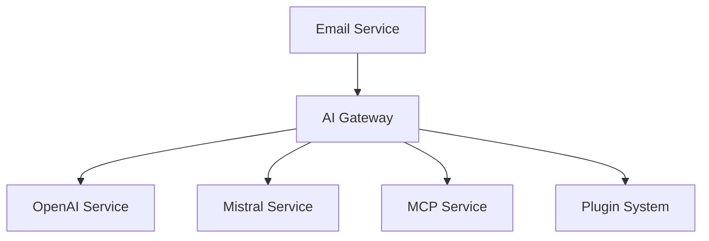

# Mailai - AI Email Assistant

Mailai is a personal automated service that uses artificial intelligence to respond to unread emails.

## 🚀 Features

- Automatic monitoring of unread emails
- Email processing with your favorite AI provider
- Customizable pre-prompts support
- Secure IMAP connection handling
- Bcc option for email responses (for human monitoring of AI responses)


## 📋 Prerequisites

- Node.js installed on your computer
- Email account (Gmail recommended for simplicity)
- OpenAI API key

## 🚀 Deployment Options

### 1. Local Installation
Best for personal use and testing:
```bash
git clone https://github.com/JeanHuguesRobert/mailai
cd mailai
npm install
node index.js
```

### 2. Browser-Based Version
Access Mailai through any web browser:
1. Visit https://JeanHuguesRobert.github.io/mailai
2. Configure your email settings
3. Use directly from the browser

Features:
- No local installation needed
- Works on all devices
- Real-time email monitoring
- PWA support for mobile

### 3. Mobile Access
Multiple options for mobile users:

A. **Browser (Recommended)**
   - Visit the web version
   - Add to home screen for PWA features
   - Full functionality, no installation

B. **Native Apps**
   - Android: Use Termux (advanced users)
   - iOS: Use Shortcuts integration
   - Cross-platform: PWA installation

### 4. Self-Hosted Server
For advanced users wanting full control:
```bash
# Clone and setup
git clone https://github.com/JeanHuguesRobert/mailai
cd mailai

# Option A: Direct Node.js
npm install
node index.js

# Option B: Using Docker
docker-compose up -d
```

## 📱 Running the Service

### Scheduling Options

1. **Browser Version**
   - Runs continuously in browser tab
   - Automatic background checks
   - Push notifications support

2. **Local Installation**
   - Windows Task Scheduler
   - Cron jobs (Linux/Mac)

3. **Mobile**
   - PWA background sync
   - iOS Shortcuts automation
   - Android scheduled tasks

## 📱 Running on Schedule

### Windows PC (recommended)
Use Windows Task Scheduler:
1. Open Task Scheduler
2. Create Basic Task
3. Set schedule (e.g., every 15 minutes)
4. Action: Start Program
5. Program: `node`
6. Arguments: `c:\path\to\mailai\index.js`

### Mac/Linux
Add to crontab:
```bash
*/15 * * * * cd /path/to/mailai && /usr/local/bin/node index.js
```

### Mobile Phone Options
1. **Termux** (Android):
```bash
pkg install nodejs
# Set up cron job similar to Linux
```

2. **Alternative**: Use your home computer and forward mobile emails there

## 📧 Email Configuration Details

### Email Account Setup

#### Gmail
1. Go to Google Account settings > Security
2. Enable 2-Step Verification
3. Create an App Password:
   - Go to Google Account settings > Security > 2-Step Verification > App passwords
   - Select "Mail" and your device
   - Copy the generated 16-character password
4. Use the generated App password in your `.env` file:
```env
MAILAI_EMAIL_USER=your-email@gmail.com
MAILAI_EMAIL_PASSWORD=your-16-char-app-password
MAILAI_EMAIL_HOST=imap.gmail.com
MAILAI_EMAIL_PORT=993
```

#### Yahoo
1. Go to Account Info > Account Security
2. Generate an App Password
3. Use the generated App password in your `.env` file:
```env
MAILAI_EMAIL_USER=your-email@yahoo.com
MAILAI_EMAIL_PASSWORD=your-app-password
MAILAI_EMAIL_HOST=imap.mail.yahoo.com
MAILAI_EMAIL_PORT=993
```

#### Outlook
1. Go to Security > More security options
2. Enable Two-step verification
3. Create an App Password
4. Use the generated App password in your `.env` file:
```env
MAILAI_EMAIL_USER=your-email@outlook.com
MAILAI_EMAIL_PASSWORD=your-app-password
MAILAI_EMAIL_HOST=imap-mail.outlook.com
MAILAI_EMAIL_PORT=993
```

### Gmail Settings
1. Enable IMAP in Gmail:
   - Go to Gmail settings > See all settings > Forwarding and POP/IMAP
   - Enable IMAP
   - Save changes


## 📝 Response Template

```

Configure the prompt location in your `.env` file:
```env
MAILAI_PRE_PROMPT_URL=file://prompts/custom_prompt.txt
```


## 🤖 Supported AI Providers

Mailai supports multiple AI providers through its plugin system:

### Built-in Providers
1. **OpenAI**
   - GPT-3.5-turbo
   - GPT-4
   - Configuration: `MAILAI_OPENAI_API_KEY`

2. **Mistral AI**
   - Models: tiny, small, medium
   - Configuration: `MAILAI_MISTRAL_API_KEY`

### Plugin-based Providers
3. **Anthropic Claude**
   - Model: claude-3-opus
   - Configuration: `MAILAI_CLAUDE_API_KEY`

4. **Google PaLM**
   - Model: text-bison-001
   - Configuration: `MAILAI_PALM_API_KEY`
   - Plugin: palm-provider.j

5. **Meta's Llama 2**
   - Model: llama-2-70b-chat
   - Configuration: `MAILAI_LLAMA_API_KEY`

6. **Cohere**
   - Model: command
   - Configuration: `MAILAI_COHERE_API_KEY`

7. **Google Gemini**
   - Model: gemini-pro
   - Configuration: `MAILAI_GEMINI_API_KEY`

8. **Azure OpenAI**
   - Custom deployments
   - Configuration:
     ```env
     MAILAI_AZURE_API_KEY=your-key
     MAILAI_AZURE_ENDPOINT=your-endpoint
     MAILAI_AZURE_DEPLOYMENT=your-deployment
     ```

9. **Hugging Face**
   - Default: Mixtral-8x7B-Instruct
   - Configuration:
     ```env
     MAILAI_HUGGINGFACE_API_KEY=your-key
     MAILAI_HUGGINGFACE_MODEL=your-model
     ```

### Using Different Providers

1. Set the provider in your .env file:
```env
MAILAI_AI_PROVIDER=openai  # or: mistral, claude, palm, llama, cohere, gemini, azure, huggingface
```

2. Configure the appropriate API key:
```env
MAILAI_AI_API_KEY=your-api-key
```

3. Optional: Set model-specific configurations:
```env
MAILAI_AI_MODEL=your-model-name
```

### MCP Integration
Additionally, Mailai supports any MCP-compatible service through the Model Context Protocol.

## 🔧 Technologies Used

- OpenAI API
- Node.js
- IMAP
- Nodemailer


## 🛡️ Security

- Use environment variables for sensitive information
- Enable two-factor authentication for your email account
- Use an application-specific password for your email provider

## 📧 Bcc for Monitoring Multiple Email Addresses

The Bcc (Blind Carbon Copy) option allows you to monitor the AI's email responses by sending a copy of each response to specified email addresses without the primary recipient knowing. This is useful for keeping track of the AI's interactions, especially when the agent is attached to multiple email accounts for different personas.


### Configuration

By configuring the Bcc option, you will receive a copy of each email response sent by the AI agent, allowing you to monitor the interactions and ensure the AI is responding appropriately.

## 🎭 Multi-Persona Configuration

Mailai now supports multiple personas, allowing the AI to respond differently based on different roles or contexts. Configure multiple personas using these environment variables:

```env
# Base email configuration
MAILAI_EMAIL_USERS=personal@email.com,work@email.com,public@email.com

# Persona-specific configurations (0 = first email, 1 = second email, etc.)
MAILAI_PRE_PROMPT_URL_0=file://path/to/personal_prompt.txt
MAILAI_RESPONSE_TEMPLATE_URL_0=file://path/to/personal_template.txt
MAILAI_AGENT_NAME_0=Personal Assistant
MAILAI_AGENT_SIGNATURE_0=Your Personal AI

MAILAI_PRE_PROMPT_URL_1=file://path/to/work_prompt.txt
MAILAI_RESPONSE_TEMPLATE_URL_1=file://path/to/work_template.txt
MAILAI_AGENT_NAME_1=Professional Assistant
MAILAI_AGENT_SIGNATURE_1=Your Work AI

# ... and so on for each persona
```

Each persona can have its own:
- Pre-prompt for context
- Response template
- Agent name and signature
- Email monitoring settings

## 🔌 MCP Integration

Mailai supports the Model Context Protocol (MCP) for enhanced context awareness:

### Setup MCP
1. Install an MCP server (e.g., from Claude Desktop app)
2. Configure MCP in your .env:
```env
MAILAI_MCP_ENABLED=true
MAILAI_MCP_SERVER_URL=http://localhost:3000
MAILAI_MCP_CREDENTIALS=your-mcp-credentials
```

MCP enhances responses by providing additional context from connected systems.

## 🏗️ Technical Architecture

### Core Components



1. **Email Service**
   - IMAP monitoring for incoming emails
   - SMTP for sending responses
   - Multi-persona support

2. **AI Gateway**
   - Abstract interface for AI providers
   - Context management
   - Response formatting

3. **AI Services**
   - OpenAI (GPT-3.5/4)
   - Mistral AI
   - MCP-enabled services

4. **Plugin System**
   - Hook-based architecture
   - Pre/post processing
   - Error handling

### Plugin Development

Create plugins to extend Mailai's functionality:

1. Create a new file in `plugins/enabled/`:
```javascript
const { MailAIPlugin } = require('../base');

class MyPlugin extends MailAIPlugin {
  async beforeProcessEmail(emailData) {
    // Modify or enhance email data
    return emailData;
  }

  async afterProcessEmail(emailData, response) {
    // Modify AI response
    return response;
  }

  async beforeSendEmail(emailOptions) {
    // Modify email before sending
    return emailOptions;
  }
}

module.exports = MyPlugin;
```

2. Configure plugin (optional):
```env
MAILAI_PLUGIN_MYPLUGIN={"option1": "value1"}
```

Available hooks:
- `beforeProcessEmail`: Modify email before AI processing
- `afterProcessEmail`: Modify AI response
- `beforeSendEmail`: Modify email options before sending
- `onError`: Handle errors

## 📱 Mobile & Web Access

### Progressive Web App
Access Mailai from any device:
1. Visit `https://your-server/mailai`
2. Click "Add to Home Screen"
3. Run as a native-like app

### Mobile Options

1. **PWA (Recommended)**
   - Works on iOS and Android
   - No installation required
   - Auto-updates

2. **Termux (Android Advanced)**
```bash
pkg install nodejs
git clone https://github.com/yourusername/mailai
cd mailai
npm install
node index.js
```

3. **iOS Shortcuts**
   - Create an automation that calls your Mailai web endpoint
   - Schedule periodic checks
   - Receive notifications

### Web Interface

1. **Self-hosted**
   ```bash
   cd web
   python -m http.server 8080
   # Or any static file server
   ```

2. **Browser Extension**
   - Monitor emails in real-time
   - Respond directly from your browser
   - Configure multiple accounts

## 🖥️ Monitor Configuration

The HTTP monitoring interface can be configured in several ways:

1. **Environment Variable**:
```env
MAILAI_HTTP_PORT=3000
```

2. **Command Line**:
```bash
node index.js --port=3000
```

3. **Default**: Uses port 3000 if not specified

## 📄 License

MIT © Jean Hugues Noël Robert
