# MailAI Architecture Overview

## System Overview

MailAI is a multi-persona email automation system that uses AI to process and respond to emails. The system is designed around these core principles:

1. **Multi-Persona Support**: Each email account can have its own identity and AI configuration
2. **Pluggable AI Providers**: Easily switch between different AI services
3. **Robust Processing**: Reliable email handling with retries and error recovery
4. **Flexible Configuration**: Environment-based configuration with strong validation
5. **Comprehensive Logging**: Mode-specific logging for different environments

## Core Components

### 1. Configuration System (src/config.js)
- **Environment Parser**
  - Validates all MAILAI_* environment variables
  - Enforces case rules (uppercase core, preserved persona case)
  - Processes multi-persona configurations
- **AI Configuration**
  - Provider-specific settings
  - Optional prompts for all providers
  - Unavailable mode handling
- **Validation Layer**
  - Type checking
  - Required field validation
  - Case sensitivity rules

### 2. Email Processing Pipeline (src/services/email.js)
- **IMAP Connection Manager**
  - Secure connection handling
  - Connection pooling
  - Error recovery
- **Email Processor**
  - Batch processing
  - Rate limiting
  - Cooldown periods
- **Response Generator**
  - AI provider integration
  - Template processing
  - BCC monitoring

### 3. Mode System
- **Development Mode**
  - Full debug logging
  - SMTP/IMAP debugging
  - Stack traces
  - Colored console output
- **Production Mode**
  - Essential logging only
  - Performance optimized
  - Clean error messages
- **Testing Mode**
  - [TEST] subject prefixes
  - Test headers
  - Magenta console output
- **Dry Run Mode**
  - No actual sending
  - Action simulation
  - Cyan console output

### 4. Plugin System (plugins/)
- **Base Plugin Class**
  ```javascript
  class MailAIPlugin {
    async beforeProcessEmail(emailData)
    async processEmail(emailData)
    async afterProcessEmail(emailData, response)
    async onError(error, emailData)
  }
  ```
- **Built-in Providers**
  - OpenAI
  - Claude
  - Mistral
  - Unavailable (special handler)
- **Custom Provider Support**
  - Plugin discovery
  - Hot-reloading
  - Error isolation

### 5. Logging System (src/utils/logger.js)
- **Mode-Specific Logs**
  - File: logs/mailai-{mode}-YYYY-MM-DD.log
  - Console formatting
  - Level filtering
- **Statistics Tracking**
  - Process counts
  - Error rates
  - Response times
- **Monitoring**
  - BCC copying
  - Rate tracking
  - Sender history

## System Architecture Diagrams

### Component Interaction
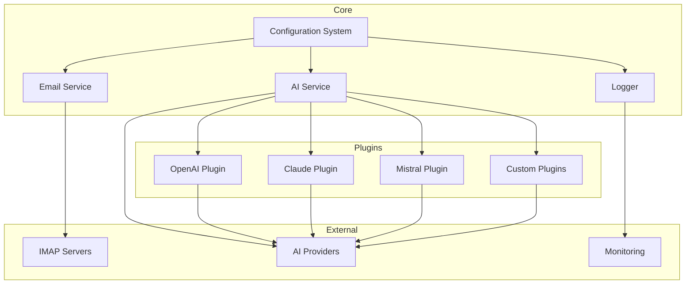
```mermaid
graph TB
    subgraph Core
        Config[Configuration System]
        Email[Email Service]
        AI[AI Service]
        Logger[Logger]
    end
    
    subgraph Plugins
        OpenAI[OpenAI Plugin]
        Claude[Claude Plugin]
        Mistral[Mistral Plugin]
        Custom[Custom Plugins]
    end
    
    subgraph External
        IMAP[IMAP Servers]
        AIProviders[AI Providers]
        Monitor[Monitoring]
    end
    
    Config --> Email
    Config --> AI
    Config --> Logger
    
    Email --> IMAP
    AI --> AIProviders
    Logger --> Monitor
    
    AI --> OpenAI & Claude & Mistral & Custom
    OpenAI & Claude & Mistral & Custom --> AIProviders
```

### Multi-Persona Configuration Flow
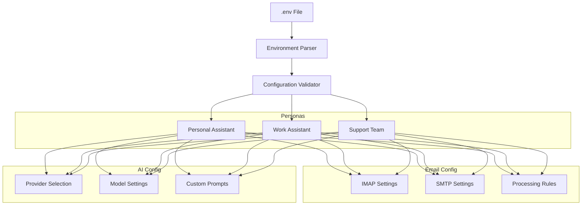
```mermaid
graph TD
    ENV[.env File] --> Parser[Environment Parser]
    Parser --> Validator[Configuration Validator]
    
    subgraph Personas
        P1[Personal Assistant]
        P2[Work Assistant]
        P3[Support Team]
    end
    
    Validator --> P1 & P2 & P3
    
    subgraph Email Config
        E1[IMAP Settings]
        E2[SMTP Settings]
        E3[Processing Rules]
    end
    
    subgraph AI Config
        A1[Provider Selection]
        A2[Model Settings]
        A3[Custom Prompts]
    end
    
    P1 & P2 & P3 --> E1 & E2 & E3
    P1 & P2 & P3 --> A1 & A2 & A3
```

### Plugin System Architecture
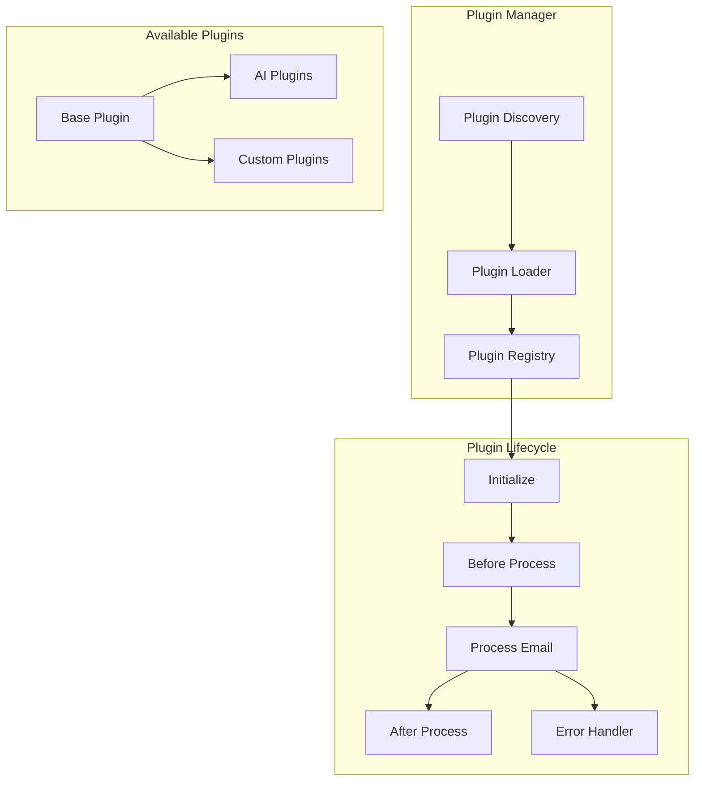
```mermaid
graph TB
    subgraph Plugin Manager
        Discovery[Plugin Discovery]
        Loader[Plugin Loader]
        Registry[Plugin Registry]
    end
    
    subgraph Plugin Lifecycle
        Init[Initialize]
        Before[Before Process]
        Process[Process Email]
        After[After Process]
        Error[Error Handler]
    end
    
    subgraph Available Plugins
        Base[Base Plugin]
        AI[AI Plugins]
        Custom[Custom Plugins]
    end
    
    Discovery --> Loader
    Loader --> Registry
    Registry --> Init
    
    Init --> Before --> Process --> After
    Process --> Error
    
    Base --> AI
    Base --> Custom
```

### Mode-Specific Behavior
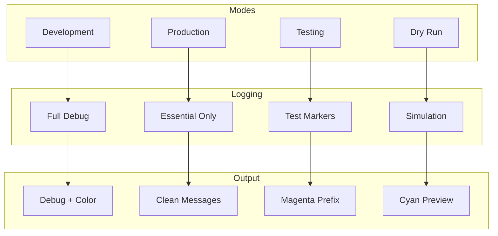
```mermaid
graph TB
    subgraph Modes
        Dev[Development]
        Prod[Production]
        Test[Testing]
        Dry[Dry Run]
    end
    
    subgraph Logging
        DevLog[Full Debug]
        ProdLog[Essential Only]
        TestLog[Test Markers]
        DryLog[Simulation]
    end
    
    subgraph Output
        DevOut[Debug + Color]
        ProdOut[Clean Messages]
        TestOut[Magenta Prefix]
        DryOut[Cyan Preview]
    end
    
    Dev --> DevLog --> DevOut
    Prod --> ProdLog --> ProdOut
    Test --> TestLog --> TestOut
    Dry --> DryLog --> DryOut
```

### Email Processing States
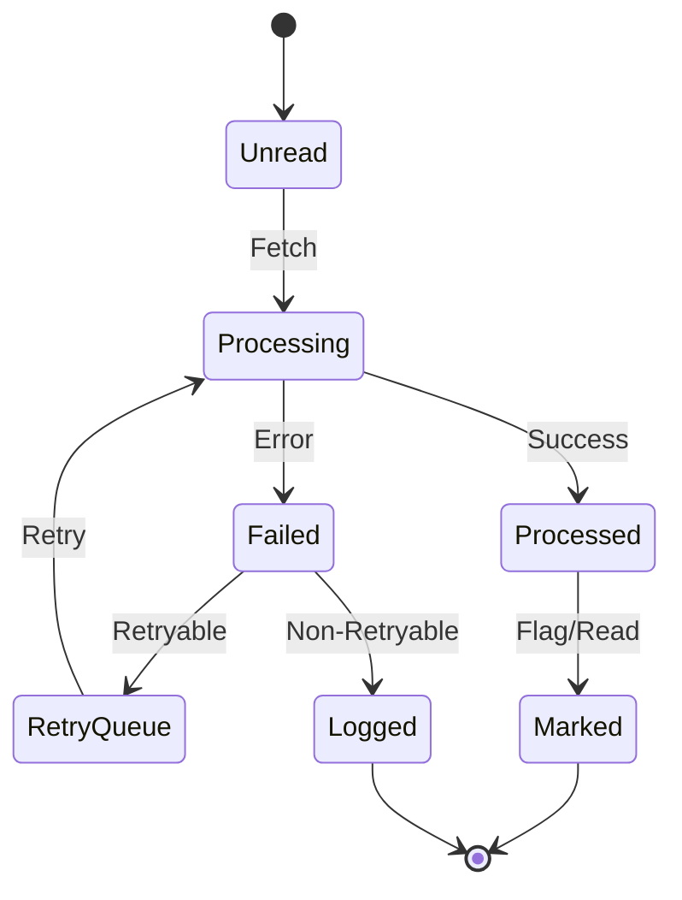
```mermaid
stateDiagram-v2
    [*] --> Unread
    Unread --> Processing: Fetch
    Processing --> Failed: Error
    Processing --> Processed: Success
    Failed --> RetryQueue: Retryable
    Failed --> Logged: Non-Retryable
    RetryQueue --> Processing: Retry
    Processed --> Marked: Flag/Read
    Marked --> [*]
    Logged --> [*]
```

### Configuration Validation Flow
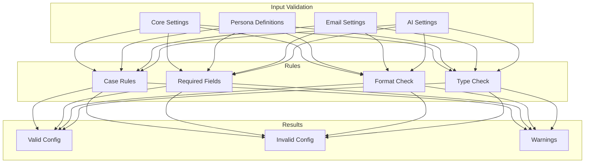
```mermaid
graph TD
    subgraph Input Validation
        Core[Core Settings]
        Persona[Persona Definitions]
        Email[Email Settings]
        AI[AI Settings]
    end
    
    subgraph Rules
        Case[Case Rules]
        Required[Required Fields]
        Format[Format Check]
        Types[Type Check]
    end
    
    subgraph Results
        Valid[Valid Config]
        Invalid[Invalid Config]
        Warnings[Warnings]
    end
    
    Core & Persona & Email & AI --> Case
    Core & Persona & Email & AI --> Required
    Core & Persona & Email & AI --> Format
    Core & Persona & Email & AI --> Types
    
    Case & Required & Format & Types --> Valid
    Case & Required & Format & Types --> Invalid
    Case & Required & Format & Types --> Warnings
```

### Resource Management
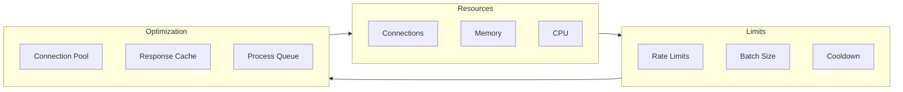
```mermaid
graph LR
    subgraph Resources
        Conn[Connections]
        Mem[Memory]
        CPU[CPU]
    end
    
    subgraph Limits
        Rate[Rate Limits]
        Batch[Batch Size]
        Cool[Cooldown]
    end
    
    subgraph Optimization
        Pool[Connection Pool]
        Cache[Response Cache]
        Queue[Process Queue]
    end
    
    Resources --> Limits
    Limits --> Optimization
    Optimization --> Resources
```

## Sequence Diagrams

### 1. Email Processing Sequence
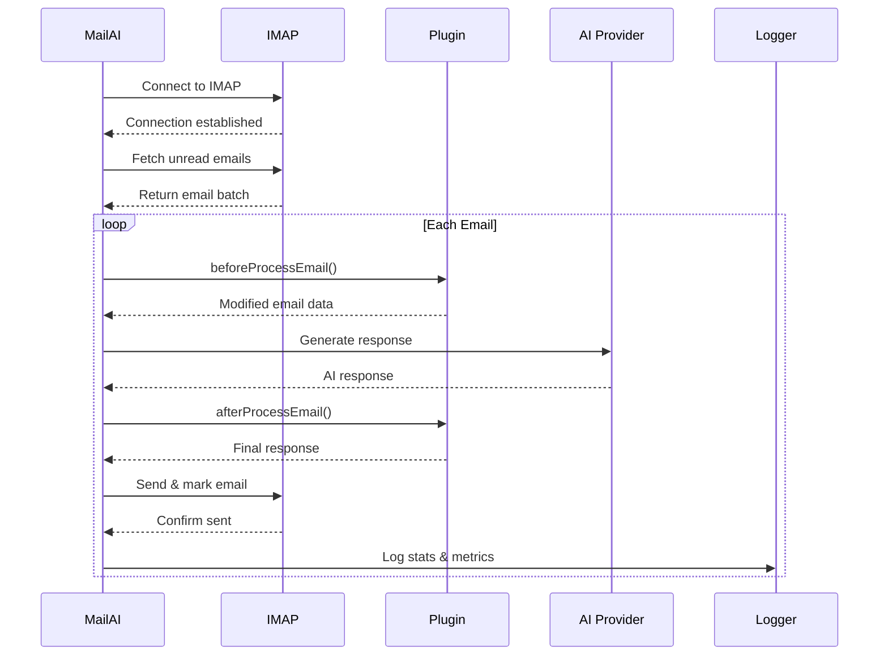
```mermaid
sequenceDiagram
    participant M as MailAI
    participant I as IMAP
    participant P as Plugin
    participant A as AI Provider
    participant L as Logger

    M->>I: Connect to IMAP
    I-->>M: Connection established
    M->>I: Fetch unread emails
    I-->>M: Return email batch
    
    loop Each Email
        M->>P: beforeProcessEmail()
        P-->>M: Modified email data
        
        M->>A: Generate response
        A-->>M: AI response
        
        M->>P: afterProcessEmail()
        P-->>M: Final response
        
        M->>I: Send & mark email
        I-->>M: Confirm sent
        
        M->>L: Log stats & metrics
    end
```

### 2. Plugin Loading Sequence
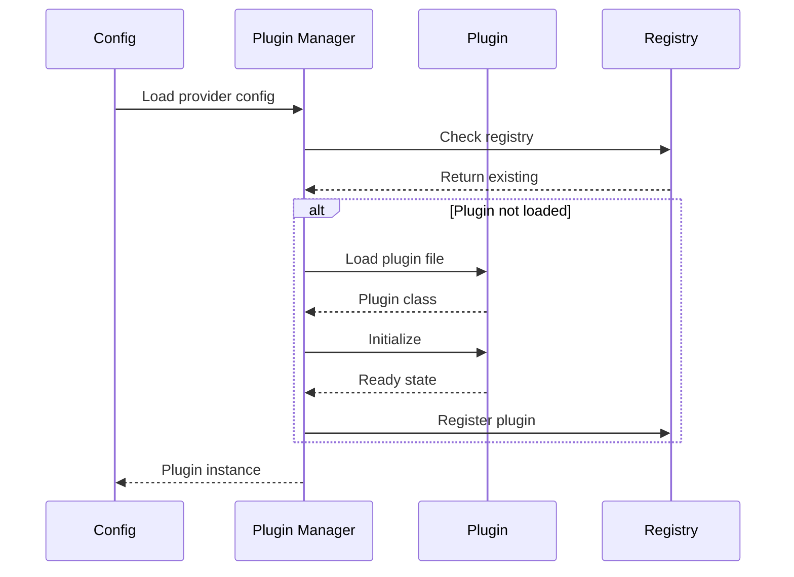
```mermaid
sequenceDiagram
    participant C as Config
    participant PM as Plugin Manager
    participant P as Plugin
    participant R as Registry

    C->>PM: Load provider config
    PM->>R: Check registry
    R-->>PM: Return existing
    
    alt Plugin not loaded
        PM->>P: Load plugin file
        P-->>PM: Plugin class
        PM->>P: Initialize
        P-->>PM: Ready state
        PM->>R: Register plugin
    end
    
    PM-->>C: Plugin instance
```

### 3. Configuration Loading
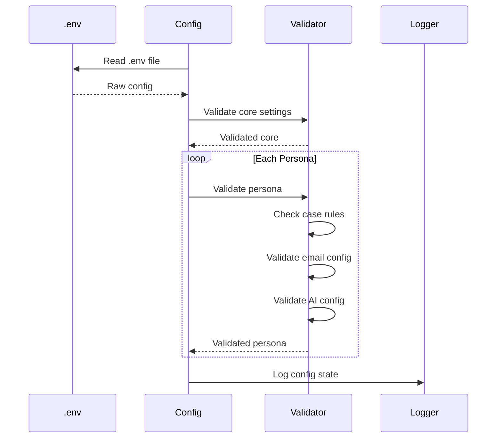
```mermaid
sequenceDiagram
    participant E as .env
    participant C as Config
    participant V as Validator
    participant L as Logger

    C->>E: Read .env file
    E-->>C: Raw config
    
    C->>V: Validate core settings
    V-->>C: Validated core
    
    loop Each Persona
        C->>V: Validate persona
        V->>V: Check case rules
        V->>V: Validate email config
        V->>V: Validate AI config
        V-->>C: Validated persona
    end
    
    C->>L: Log config state
```

### 4. Error Handling Flow
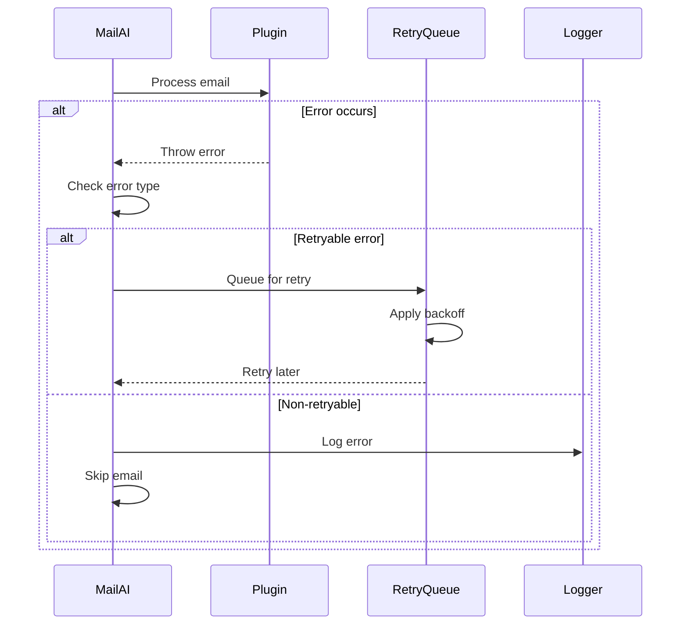
```mermaid
sequenceDiagram
    participant M as MailAI
    participant P as Plugin
    participant Q as RetryQueue
    participant L as Logger

    M->>P: Process email
    
    alt Error occurs
        P-->>M: Throw error
        M->>M: Check error type
        
        alt Retryable error
            M->>Q: Queue for retry
            Q->>Q: Apply backoff
            Q-->>M: Retry later
        else Non-retryable
            M->>L: Log error
            M->>M: Skip email
        end
    end
```

### 5. Mode Transition Flow
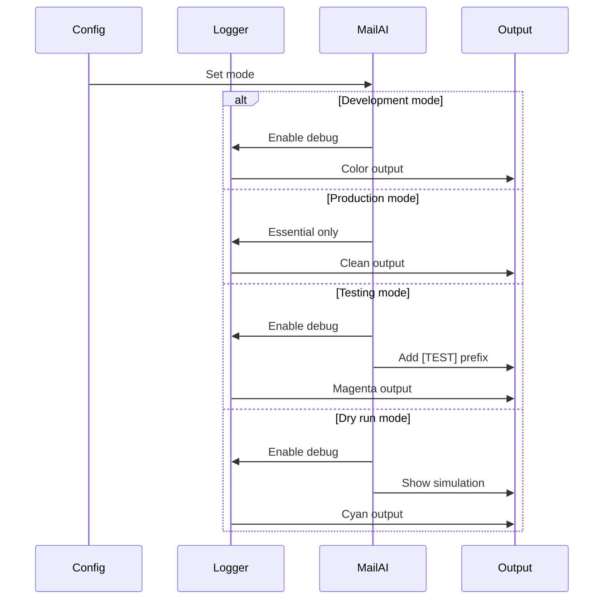
```mermaid
sequenceDiagram
    participant C as Config
    participant L as Logger
    participant M as MailAI
    participant O as Output

    C->>M: Set mode
    
    alt Development mode
        M->>L: Enable debug
        L->>O: Color output
    else Production mode
        M->>L: Essential only
        L->>O: Clean output
    else Testing mode
        M->>L: Enable debug
        M->>O: Add [TEST] prefix
        L->>O: Magenta output
    else Dry run mode
        M->>L: Enable debug
        M->>O: Show simulation
        L->>O: Cyan output
    end
```

### Monitoring Sequences

#### 1. Statistics Collection
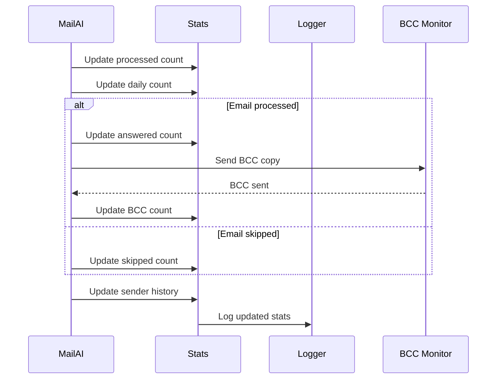
```mermaid
sequenceDiagram
    participant M as MailAI
    participant S as Stats
    participant L as Logger
    participant B as BCC Monitor

    M->>S: Update processed count
    M->>S: Update daily count
    
    alt Email processed
        M->>S: Update answered count
        M->>B: Send BCC copy
        B-->>M: BCC sent
        M->>S: Update BCC count
    else Email skipped
        M->>S: Update skipped count
    end
    
    M->>S: Update sender history
    S->>L: Log updated stats
```

#### 2. Rate Limiting Flow
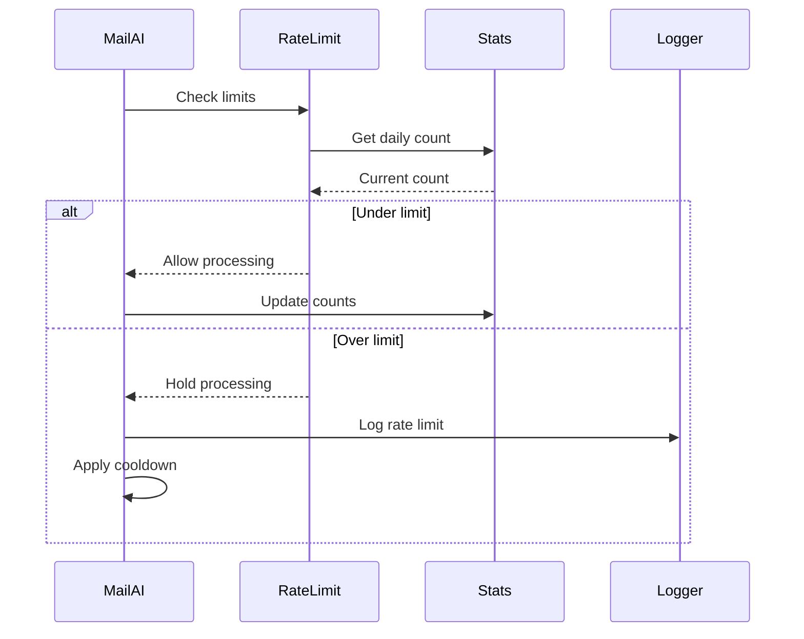
```mermaid
sequenceDiagram
    participant M as MailAI
    participant R as RateLimit
    participant S as Stats
    participant L as Logger

    M->>R: Check limits
    R->>S: Get daily count
    S-->>R: Current count
    
    alt Under limit
        R-->>M: Allow processing
        M->>S: Update counts
    else Over limit
        R-->>M: Hold processing
        M->>L: Log rate limit
        M->>M: Apply cooldown
    end
```

#### 3. Health Check Flow
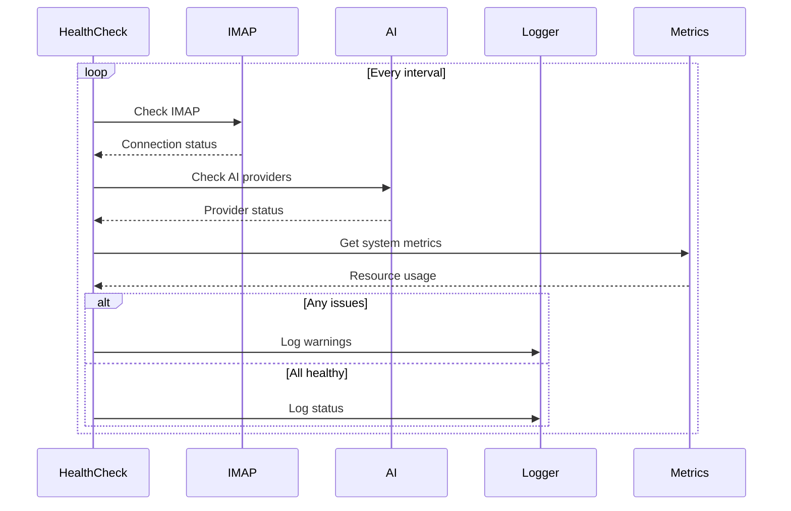
```mermaid
sequenceDiagram
    participant HC as HealthCheck
    participant I as IMAP
    participant A as AI
    participant L as Logger
    participant M as Metrics

    loop Every interval
        HC->>I: Check IMAP
        I-->>HC: Connection status
        
        HC->>A: Check AI providers
        A-->>HC: Provider status
        
        HC->>M: Get system metrics
        M-->>HC: Resource usage
        
        alt Any issues
            HC->>L: Log warnings
        else All healthy
            HC->>L: Log status
        end
    end
```

#### 4. Performance Monitoring
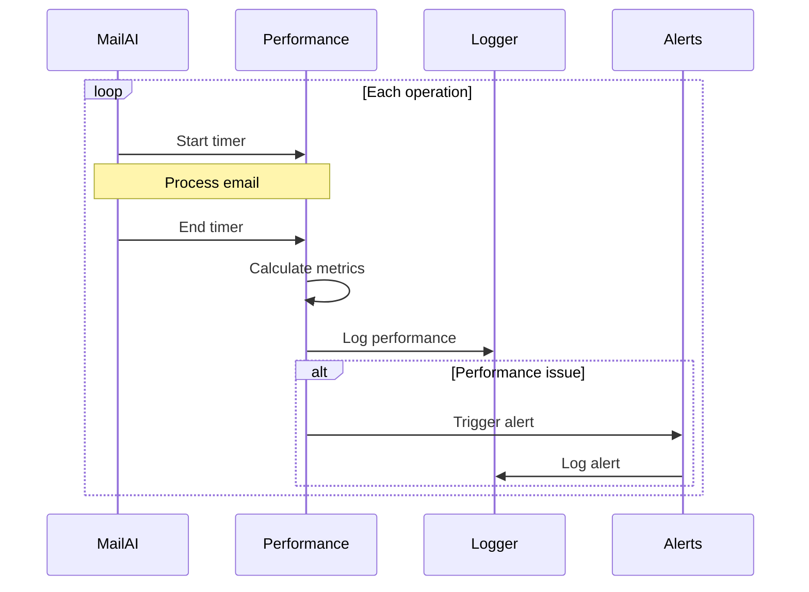
```mermaid
sequenceDiagram
    participant M as MailAI
    participant P as Performance
    participant L as Logger
    participant A as Alerts

    loop Each operation
        M->>P: Start timer
        Note over M,P: Process email
        M->>P: End timer
        
        P->>P: Calculate metrics
        P->>L: Log performance
        
        alt Performance issue
            P->>A: Trigger alert
            A->>L: Log alert
        end
    end
```

#### 5. Alert System Flow
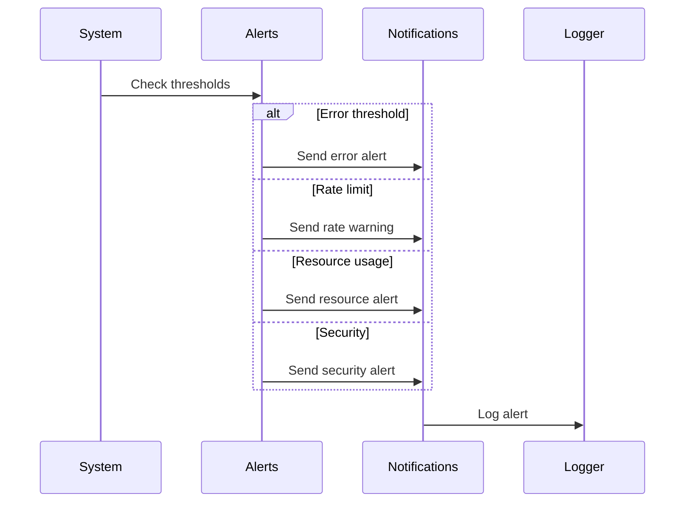
```mermaid
sequenceDiagram
    participant S as System
    participant A as Alerts
    participant N as Notifications
    participant L as Logger

    S->>A: Check thresholds
    
    alt Error threshold
        A->>N: Send error alert
    else Rate limit
        A->>N: Send rate warning
    else Resource usage
        A->>N: Send resource alert
    else Security
        A->>N: Send security alert
    end
    
    N->>L: Log alert
```

## Security Flow Diagrams

#### 1. Authentication Flow
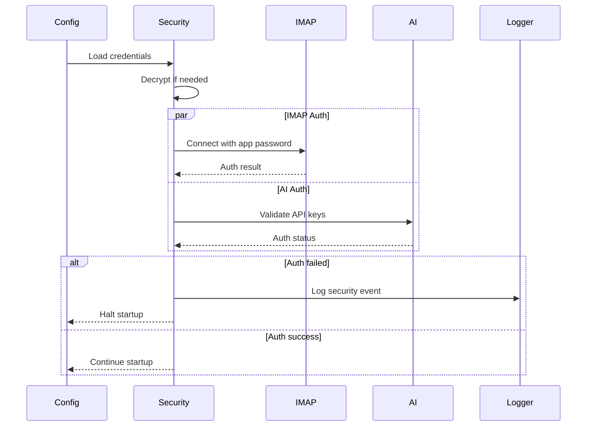
```mermaid
sequenceDiagram
    participant C as Config
    participant S as Security
    participant I as IMAP
    participant A as AI
    participant L as Logger

    C->>S: Load credentials
    S->>S: Decrypt if needed
    
    par IMAP Auth
        S->>I: Connect with app password
        I-->>S: Auth result
    and AI Auth
        S->>A: Validate API keys
        A-->>S: Auth status
    end
    
    alt Auth failed
        S->>L: Log security event
        S-->>C: Halt startup
    else Auth success
        S-->>C: Continue startup
    end
```

#### 2. Email Security Flow
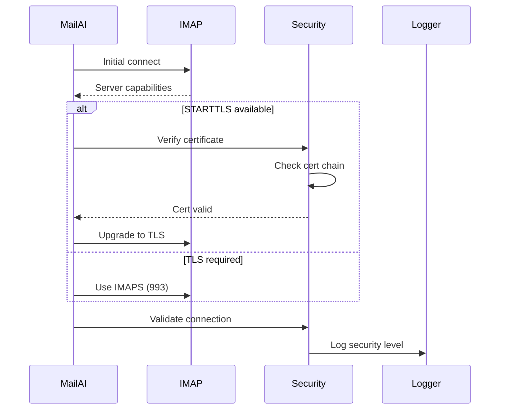
```mermaid
sequenceDiagram
    participant M as MailAI
    participant I as IMAP
    participant S as Security
    participant L as Logger

    M->>I: Initial connect
    I-->>M: Server capabilities
    
    alt STARTTLS available
        M->>S: Verify certificate
        S->>S: Check cert chain
        S-->>M: Cert valid
        M->>I: Upgrade to TLS
    else TLS required
        M->>I: Use IMAPS (993)
    end
    
    M->>S: Validate connection
    S->>L: Log security level
```

#### 3. Credential Management
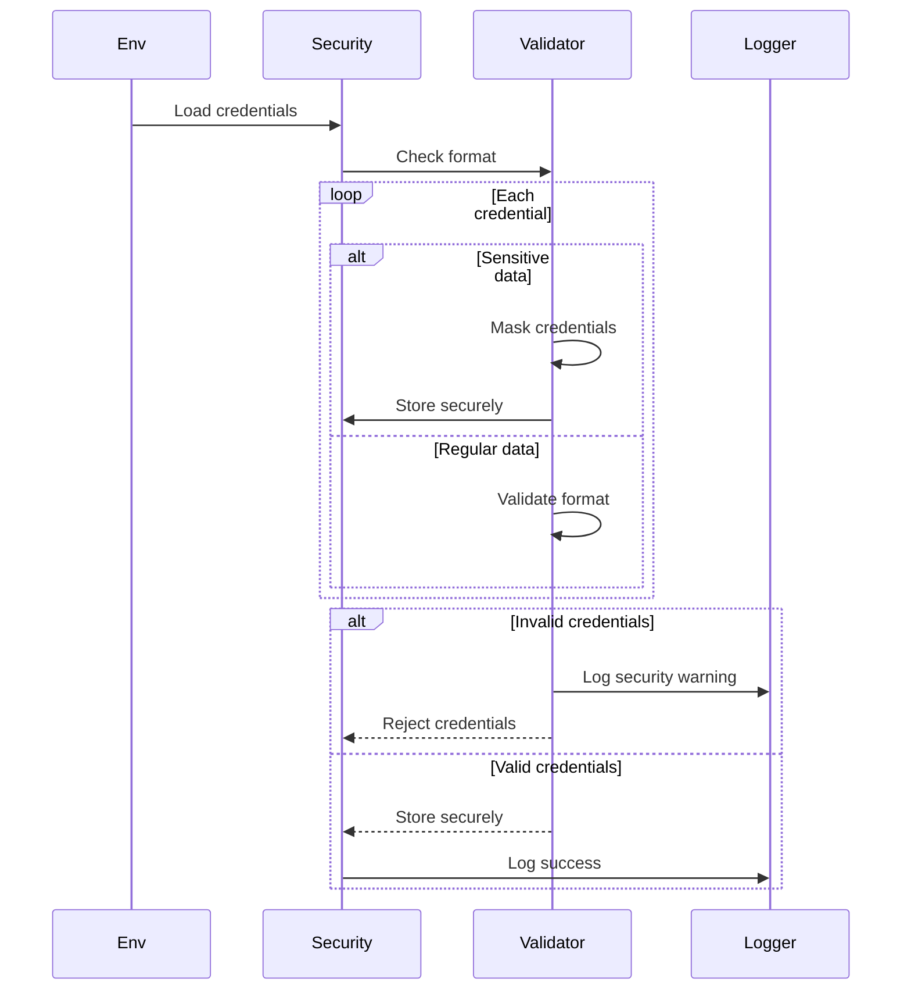
```mermaid
sequenceDiagram
    participant E as Env
    participant S as Security
    participant V as Validator
    participant L as Logger

    E->>S: Load credentials
    S->>V: Check format
    
    loop Each credential
        alt Sensitive data
            V->>V: Mask credentials
            V->>S: Store securely
        else Regular data
            V->>V: Validate format
        end
    end
    
    alt Invalid credentials
        V->>L: Log security warning
        V-->>S: Reject credentials
    else Valid credentials
        V-->>S: Store securely
        S->>L: Log success
    end
```

#### 4. Rate Protection Flow
```mermaid
sequenceDiagram
    participant R as Request
    participant S as Security
    participant L as Limiter
    participant B as Blacklist
    participant Log as Logger

    R->>S: Incoming request
    S->>L: Check rate
    
    alt Over limit
        L->>B: Check history
        B->>B: Update count
        
        alt Repeated abuse
            B->>B: Add to blacklist
            B->>Log: Log security event
        else First time
            B->>Log: Log warning
        end
        
        L-->>S: Reject request
    else Within limit
        L-->>S: Allow request
        S->>Log: Log activity
    end
```

#### 5. Plugin Security Flow
```mermaid
sequenceDiagram
    participant P as Plugin
    participant S as Security
    participant V as Validator
    participant I as Isolate
    participant L as Logger

    P->>S: Load plugin
    S->>V: Validate signature
    
    alt Invalid signature
        V-->>S: Reject plugin
        S->>L: Log security alert
    else Valid signature
        V-->>S: Continue loading
        S->>I: Create sandbox
        I->>P: Run in isolation
        P-->>I: Plugin ready
    end
```

These security flows demonstrate:
1. Secure authentication handling
2. Email connection security
3. Credential management
4. Rate limiting protection
5. Plugin security measures

Key security features:
- App-specific passwords only
- TLS/SSL enforcement
- Credential encryption
- Rate limiting
- Plugin isolation

Would you like me to:
1. Add API security?
2. Add data protection flows?
3. Or something else?

## Data Flow

1. **Email Discovery**
   ```mermaid
   graph LR
   A[IMAP Connect] --> B[Fetch Unread]
   B --> C[Filter by Date]
   C --> D[Build Batch]
   D --> E[Process Batch]
   ```

2. **Processing Pipeline**
   ```mermaid
   graph LR
   A[Read Email] --> B[Extract Content]
   B --> C[AI Processing]
   C --> D[Generate Response]
   D --> E[Send & Mark]
   ```

3. **Error Handling**
   ```mermaid
   graph TD
   A[Error Occurs] --> B{Retryable?}
   B -->|Yes| C[Queue Retry]
   B -->|No| D[Log Error]
   C --> E[Backoff Timer]
   E --> F[Retry Process]
   ```

## Data Protection Flows

#### 1. Configuration Data Protection
```mermaid
sequenceDiagram
    participant E as Environment
    participant P as Parser
    participant V as Validator
    participant S as Secure Store
    participant L as Logger

    E->>P: Load .env
    P->>V: Parse variables
    
    loop Each Setting
        alt Sensitive data
            V->>V: Mask credentials
            V->>S: Store securely
        else Regular data
            V->>V: Validate format
        end
    end
    
    V->>L: Log safe data only
```

#### 2. Persona Data Handling
```mermaid
sequenceDiagram
    participant C as Config
    participant P as Persona
    participant A as AI
    participant S as Security
    participant L as Logger

    C->>P: Load persona
    
    par Email Config
        P->>S: Load email settings
        S->>S: Mask password
    and AI Config
        P->>S: Load AI settings
        S->>S: Mask API keys
    and Prompt Config
        P->>A: Load prompt
        A->>S: Validate prompt
    end
    
    alt Unavailable mode
        P->>S: Store message
        P->>S: Store prompt
        S->>L: Log config
    end
```

#### 3. Email Content Protection
```mermaid
sequenceDiagram
    participant M as MailAI
    participant E as Email
    participant S as Sanitizer
    participant A as AI
    participant L as Logger

    M->>E: Receive email
    E->>S: Extract content
    
    S->>S: Remove PII
    S->>S: Sanitize headers
    S->>S: Clean metadata
    
    alt Contains sensitive data
        S->>L: Log warning
        S->>S: Apply extra filtering
    end
    
    S->>A: Safe content only
```

#### 4. Response Data Protection
```mermaid
sequenceDiagram
    participant A as AI
    participant F as Filter
    participant T as Template
    participant E as Email
    participant L as Logger

    A->>F: Generate response
    F->>F: Check content safety
    
    alt Contains sensitive data
        F->>F: Redact content
        F->>L: Log alert
    end
    
    F->>T: Safe response
    T->>T: Apply template
    T->>E: Send email
```

#### 5. Storage Protection Flow
```mermaid
sequenceDiagram
    participant M as MailAI
    participant D as Data
    participant E as Encryption
    participant S as Storage
    participant L as Logger

    M->>D: Data to store
    
    alt Sensitive data
        D->>E: Encrypt data
        E->>S: Store encrypted
    else Regular data
        D->>S: Store directly
    end
    
    S->>L: Log operation
```

These data protection flows ensure:

1. **Configuration Security**
   - Secure credential handling
   - Prompt protection
   - Masked sensitive data

2. **Persona Privacy**
   - Protected email settings
   - Secure AI configurations
   - Safe prompt handling

3. **Content Protection**
   - Email content sanitization
   - PII removal
   - Metadata cleaning

4. **Response Safety**
   - Content filtering
   - Template safety
   - Secure delivery

5. **Storage Security**
   - Encrypted sensitive data
   - Safe logging practices
   - Access control

Would you like me to:
1. Add backup protection flows?
2. Add audit trail flows?
3. Or something else?

## Audit Trail Flows

#### 1. Operation Auditing
```mermaid
sequenceDiagram
    participant M as MailAI
    participant O as Operation
    participant A as Audit
    participant L as Logger
    participant S as Storage

    M->>O: Start operation
    O->>A: Create audit entry
    
    A->>A: Add timestamp
    A->>A: Add operation type
    A->>A: Add persona ID
    
    alt Mode specific
        A->>A: Add [TEST] marker
        A->>A: Add dry run info
    end
    
    A->>L: Log audit entry
    A->>S: Store audit record
```

#### 2. Configuration Change Tracking
```mermaid
sequenceDiagram
    participant C as Config
    participant A as Audit
    participant D as Diff
    participant L as Logger
    participant N as Notify

    C->>A: Config changed
    A->>D: Compare changes
    
    D->>D: Check sensitive fields
    D->>D: Mask credentials
    
    alt Critical changes
        D->>N: Send alert
    end
    
    D->>L: Log safe diff
    A->>A: Record change
```

#### 3. Persona Activity Trail
```mermaid
sequenceDiagram
    participant P as Persona
    participant A as Audit
    participant S as Stats
    participant L as Logger

    P->>A: Record activity
    
    par Stats Update
        A->>S: Update counters
        S->>S: Calculate rates
    and Activity Log
        A->>A: Add metadata
        A->>A: Add mode info
        A->>A: Add prompt used
    end
    
    alt Unavailable mode
        A->>A: Log message
        A->>A: Log prompt
    end
    
    A->>L: Store activity
```

#### 4. Email Processing Audit
```mermaid
sequenceDiagram
    participant E as Email
    participant A as Audit
    participant P as Process
    participant L as Logger
    participant M as Metrics

    E->>A: Start processing
    A->>A: Record start time
    
    loop Each step
        P->>A: Log step
        A->>A: Add timestamp
        A->>M: Update metrics
    end
    
    alt Processing complete
        P->>A: Record success
        A->>A: Add response info
    else Processing failed
        P->>A: Record failure
        A->>A: Add error details
    end
    
    A->>L: Save audit trail
```

#### 5. Security Event Tracking
```mermaid
sequenceDiagram
    participant S as Security
    participant A as Audit
    participant E as Event
    participant L as Logger
    participant N as Notify

    S->>E: Detect event
    E->>A: Create record
    
    A->>A: Add severity
    A->>A: Add context
    A->>A: Add source
    
    alt High severity
        A->>N: Send alert
        N->>N: Notify admin
    end
    
    A->>L: Log event
```

These audit flows ensure:

1. **Operation Tracking**
   - Timestamped operations
   - Mode-specific markers
   - Complete audit trail

2. **Configuration Auditing**
   - Change tracking
   - Secure diff logging
   - Critical change alerts

3. **Persona Monitoring**
   - Activity tracking
   - Stats collection
   - Prompt usage logs

4. **Process Verification**
   - Step-by-step tracking
   - Error recording
   - Success verification

5. **Security Auditing**
   - Event severity tracking
   - Context preservation
   - Alert mechanisms


## Compliance Flow Diagrams

#### 1. Configuration Standards Compliance
```mermaid
sequenceDiagram
    participant E as Environment
    participant V as Validator
    participant C as Compliance
    participant L as Logger

    E->>V: Load config
    V->>C: Check standards
    
    par Core Settings
        C->>C: Verify uppercase
        C->>C: Check required fields
    and Persona Settings
        C->>C: Preserve case
        C->>C: Validate format
    and AI Settings
        C->>C: Check lowercase
        C->>C: Validate provider
    end
    
    alt Non-compliant
        C->>L: Log violation
        C-->>V: Reject config
    else Compliant
        C-->>V: Accept config
    end
```

#### 2. Unavailable Mode Flow
```mermaid
sequenceDiagram
    participant C as Config
    participant U as Unavailable
    participant P as Processor
    participant L as Logger

    C->>U: Load settings
    
    alt Has custom message
        U->>U: Store message
    else Default
        U->>U: Use default message
    end
    
    alt Has prompt
        U->>U: Store prompt
        U->>U: Format as [prompt]
    end
    
    U->>P: Process email
    P->>P: Generate response
    P->>P: Include prompt if present
    P->>L: Log response
```

#### 3. Persona Configuration Flow
```mermaid
sequenceDiagram
    participant C as Config
    participant P as Parser
    participant V as Validator
    participant L as Logger

    C->>P: Load persona
    P->>V: Check format
    
    par Required Fields
        V->>V: Check email_user
        V->>V: Check email_password
        V->>V: Check email_imap
    and Optional Fields
        V->>V: Check email_port
        V->>V: Check marking
        V->>V: Check prompt
    end
    
    alt AI=unavailable
        V->>V: Check message
        V->>V: Check prompt
    end
    
    V->>L: Log validation
```

#### 4. Mode Compliance Flow
```mermaid
sequenceDiagram
    participant C as Config
    participant M as Mode
    participant V as Validator
    participant L as Logger

    C->>M: Set mode
    M->>V: Validate mode
    
    alt development
        V->>V: Enable debug
        V->>V: Set log path
    else production
        V->>V: Minimal logging
        V->>V: Performance mode
    else testing
        V->>V: Enable markers
        V->>V: Set test flags
    else dry_run
        V->>V: Simulation mode
        V->>V: No send
    end
    
    V->>L: Log mode config
```

#### 5. Environment Variable Flow
```mermaid
sequenceDiagram
    participant E as Env
    participant P as Parser
    participant V as Validator
    participant L as Logger

    E->>P: Load variables
    P->>V: Check format
    
    loop Each Variable
        alt Core setting
            V->>V: Must be uppercase
        else Persona ID
            V->>V: Preserve case
        else Provider name
            V->>V: Must be lowercase
        end
    end
    
    alt Invalid format
        V->>L: Log error
        V-->>P: Reject variable
    else Valid format
        V-->>P: Accept variable
    end
```

These compliance flows ensure:

1. **Configuration Standards**
   - Core settings uppercase
   - Persona case preservation
   - Provider names lowercase

2. **Unavailable Mode**
   - Optional custom message
   - Optional prompt inclusion
   - Proper formatting

3. **Persona Settings**
   - Required field validation
   - Optional field handling
   - Format compliance

4. **Mode Management**
   - Valid mode selection
   - Mode-specific settings
   - Proper logging setup

5. **Environment Variables**
   - Case sensitivity rules
   - Format validation
   - Error handling

Would you like me to:
1. Add testing flows?
2. Add deployment flows?
3. Or something else?

## Testing Flow Diagrams

#### 1. Configuration Testing Flow
```mermaid
sequenceDiagram
    participant T as Test
    participant C as Config
    participant V as Validator
    participant L as Logger

    T->>C: Load test config
    C->>V: Validate config
    
    par Core Settings
        V->>V: Test uppercase
        V->>V: Test required fields
    and Persona Settings
        V->>V: Test case preservation
        V->>V: Test ID format
    and AI Settings
        V->>V: Test lowercase
        V->>V: Test provider names
    end
    
    alt Invalid config
        V->>L: Log test failure
        V-->>T: Return errors
    else Valid config
        V->>L: Log test success
        V-->>T: Return config
    end
```

#### 2. Unavailable Mode Testing
```mermaid
sequenceDiagram
    participant T as Test
    participant U as Unavailable
    participant P as Processor
    participant A as Assertions

    T->>U: Test scenarios
    
    par No Message/Prompt
        U->>P: Default config
        P->>A: Verify default message
    and Custom Message
        U->>P: Set message only
        P->>A: Verify custom message
    and With Prompt
        U->>P: Set prompt only
        P->>A: Verify [prompt] format
    and Full Config
        U->>P: Message + prompt
        P->>A: Verify combined
    end
    
    A-->>T: Test results
```

#### 3. Mode Testing Flow
```mermaid
sequenceDiagram
    participant T as Test
    participant M as Mode
    participant L as Logger
    participant A as Assertions

    T->>M: Test each mode
    
    par Development Mode
        M->>L: Test debug logging
        L->>A: Verify output
    and Production Mode
        M->>L: Test minimal logs
        L->>A: Verify clean output
    and Testing Mode
        M->>L: Test [TEST] prefix
        L->>A: Verify markers
    and Dry Run Mode
        M->>L: Test simulation
        L->>A: Verify no-send
    end
    
    A-->>T: Mode results
```

#### 4. Persona Testing Flow
```mermaid
sequenceDiagram
    participant T as Test
    participant P as Persona
    participant C as Config
    participant A as Assertions

    T->>P: Test persona config
    
    par Required Fields
        P->>C: Test email settings
        C->>A: Verify required
    and Optional Fields
        P->>C: Test optional fields
        C->>A: Verify optional
    and AI Config
        P->>C: Test AI settings
        C->>A: Verify provider
    end
    
    alt AI=unavailable
        P->>C: Test message/prompt
        C->>A: Verify format
    end
    
    A-->>T: Test results
```

#### 5. Integration Testing Flow
```mermaid
sequenceDiagram
    participant T as Test
    participant E as Email
    participant A as AI
    participant L as Logger
    participant M as Metrics

    T->>E: Send test email
    
    alt Unavailable mode
        E->>A: Process with prompt
        A->>M: Verify response format
        M->>M: Check prompt inclusion
    else Normal mode
        E->>A: Process normally
        A->>M: Verify AI response
    end
    
    M->>L: Log test results
    L-->>T: Test summary
```

These testing flows validate:

1. **Configuration Standards**
   - Case sensitivity rules
   - Required field presence
   - Format validation

2. **Unavailable Mode**
   - Default behavior
   - Custom message handling
   - Prompt formatting
   - Combined configurations

3. **Mode Behavior**
   - Development logging
   - Production optimization
   - Test markers
   - Dry run safety

4. **Persona Setup**
   - Required fields
   - Optional settings
   - Provider configuration
   - Unavailable mode settings

5. **Integration Points**
   - Email processing
   - AI responses
   - Prompt inclusion
   - Logging verification

Would you like me to:
1. Add deployment flows?
2. Add migration flows?
3. Or something else?

## Deployment Flow Diagrams

#### 1. Environment Setup Flow
```mermaid
sequenceDiagram
    participant D as Deploy
    participant E as Env
    participant V as Validator
    participant L as Logger

    D->>E: Load environment
    E->>V: Validate setup
    
    par Core Config
        V->>V: Check MAILAI_MODE
        V->>V: Check MAILAI_LOG
    and Persona Config
        V->>V: Check MAILAI_{ID}_*
        V->>V: Validate case rules
    and AI Config
        V->>V: Check providers
        V->>V: Validate prompts
    end
    
    alt Invalid setup
        V->>L: Log errors
        V-->>D: Halt deploy
    else Valid setup
        V->>L: Log success
        V-->>D: Continue deploy
    end
```

#### 2. Persona Deployment Flow
```mermaid
sequenceDiagram
    participant D as Deploy
    participant P as Personas
    participant R as Resources
    participant L as Logger

    D->>P: Deploy personas
    
    loop Each Persona
        P->>R: Allocate resources
        
        par Email Connection
            R->>R: IMAP pool
            R->>R: Rate limits
        and AI Provider
            R->>R: API quotas
            R->>R: Concurrency
        end
        
        alt AI=unavailable
            R->>R: Minimal resources
            R->>R: Static response
        end
    end
    
    R->>L: Log allocation
```

#### 3. Mode Deployment Flow
```mermaid
sequenceDiagram
    participant D as Deploy
    participant M as Mode
    participant C as Config
    participant L as Logger

    D->>M: Set mode
    M->>C: Configure system
    
    alt development
        C->>C: Set debug=true
        C->>C: Enable verbose
    else production
        C->>C: Set debug=false
        C->>C: Optimize perf
    else testing
        C->>C: Add [TEST]
        C->>C: Enable checks
    else dry_run
        C->>C: No-send mode
        C->>C: Log only
    end
    
    C->>L: Log mode setup
```

#### 4. Provider Configuration Flow
```mermaid
sequenceDiagram
    participant D as Deploy
    participant P as Provider
    participant V as Validator
    participant L as Logger

    D->>P: Setup providers
    
    loop Each Provider
        P->>V: Check config
        
        alt unavailable
            V->>V: Verify message
            V->>V: Check prompt
        else active
            V->>V: Check API key
            V->>V: Test connection
        end
        
        V->>L: Log provider status
    end
```

#### 5. Monitoring Setup Flow
```mermaid
sequenceDiagram
    participant D as Deploy
    participant M as Monitor
    participant L as Logger
    participant A as Alerts

    D->>M: Setup monitoring
    
    par Log Setup
        M->>L: Configure paths
        L->>L: Set rotation
    and Alert Setup
        M->>A: Set thresholds
        A->>A: Configure notify
    end
    
    M->>M: Start watchers
    M->>L: Log monitor ready
```

These deployment flows ensure:

1. **Environment Setup**
   - Core variable validation
   - Case sensitivity checks
   - Required fields present

2. **Persona Configuration**
   - Email settings verified
   - AI provider setup
   - Unavailable mode config

3. **Mode Settings**
   - Environment-specific config
   - Debug level setup
   - Performance tuning

4. **Provider Setup**
   - API key validation
   - Connection testing
   - Unavailable handling

5. **Monitoring**
   - Log configuration
   - Alert setup
   - System watching

Would you like me to:
1. Add scaling flows?
2. Add backup flows?
3. Or something else?

## Scaling Flow Diagrams

#### 1. Multi-Persona Scaling
```mermaid
sequenceDiagram
    participant S as System
    participant P as Personas
    participant R as Resources
    participant L as Logger

    S->>P: Load personas
    
    loop Each Persona
        P->>R: Allocate resources
        
        par Email Connection
            R->>R: IMAP pool
            R->>R: Rate limits
        and AI Provider
            R->>R: API quotas
            R->>R: Concurrency
        end
        
        alt AI=unavailable
            R->>R: Minimal resources
            R->>R: Static response
        end
    end
    
    R->>L: Log allocation
```

#### 2. Provider Load Balancing
```mermaid
sequenceDiagram
    participant S as System
    participant P as Provider
    participant B as Balancer
    participant L as Logger

    S->>P: Use provider
    
    alt Provider down
        P->>B: Connection failed
        B->>B: Use message
        B->>B: Add prompt
    else Provider overloaded
        P->>B: API failed
        B->>B: Queue request
        B->>B: Apply backoff
    else Provider available
        B->>B: Process normally
    end
    
    B->>L: Log status
```

#### 3. Resource Management Flow
```mermaid
sequenceDiagram
    participant S as System
    participant R as Resources
    participant M as Monitor
    participant L as Logger

    S->>R: Check resources
    R->>M: Monitor usage
    
    par Memory Usage
        M->>M: Check limits
        M->>M: Optimize if high
    and CPU Usage
        M->>M: Track load
        M->>M: Balance tasks
    and Connection Pool
        M->>M: Monitor IMAP
        M->>M: Adjust pool
    end
    
    M->>L: Log metrics
```

#### 4. Queue Management Flow
```mermaid
sequenceDiagram
    participant S as System
    participant Q as Queue
    participant P as Processor
    participant L as Logger

    S->>Q: Incoming emails
    
    loop Each Email
        Q->>P: Check capacity
        
        alt System overloaded
            P->>Q: Apply backoff
            Q->>Q: Prioritize
        else Normal load
            P->>P: Process email
            alt AI unavailable
                P->>P: Quick response
                P->>P: Include prompt
            end
        end
        
        P->>L: Log processing
    end
```

#### 5. Scaling Metrics Flow
```mermaid
sequenceDiagram
    participant S as System
    participant M as Metrics
    participant A as Analyzer
    participant L as Logger

    S->>M: Collect metrics
    
    par Performance
        M->>A: Response times
        A->>A: Check thresholds
    and Resource Usage
        M->>A: System load
        A->>A: Check capacity
    and Provider Stats
        M->>A: API usage
        A->>A: Check quotas
    end
    
    alt Scaling needed
        A->>S: Adjust resources
        S->>L: Log changes
    else Normal operation
        A->>L: Log metrics
    end
```

These scaling flows ensure:

1. **Persona Management**
   - Resource allocation
   - Connection pooling
   - Rate limiting

2. **Provider Handling**
   - Load balancing
   - Unavailable mode
   - Queue management

3. **Resource Control**
   - Memory optimization
   - CPU balancing
   - Connection management

4. **Queue Processing**
   - Capacity control
   - Priority handling
   - Quick responses

5. **Performance Metrics**
   - Response monitoring
   - Resource tracking
   - Usage optimization

Would you like me to:
1. Add backup flows?
2. Add error handling flows?
3. Or something else?

## Backup Flow Diagrams

#### 1. Configuration Backup Flow
```mermaid
sequenceDiagram
    participant S as System
    participant B as Backup
    participant C as Config
    participant L as Logger

    S->>B: Backup config
    
    par Core Settings
        B->>C: Save MAILAI_MODE
        B->>C: Save MAILAI_LOG
    and Persona Settings
        B->>C: Save MAILAI_{ID}_*
        B->>C: Preserve case
    and Provider Settings
        B->>C: Save AI config
        B->>C: Save prompts
    end
    
    alt Has unavailable
        C->>C: Save messages
        C->>C: Save prompts
    end
    
    C->>L: Log backup
```

#### 2. Persona State Backup
```mermaid
sequenceDiagram
    participant S as System
    participant B as Backup
    participant P as Persona
    participant L as Logger

    S->>B: Backup personas
    
    loop Each Persona
        B->>P: Save state
        
        par Email Config
            P->>P: Save settings
            P->>P: Mask secrets
        and AI Config
            P->>P: Save provider
            P->>P: Save API info
        end
        
        alt AI=unavailable
            P->>P: Save message
            P->>P: Save prompt
        end
        
        P->>L: Log backup
    end
```

#### 3. Recovery Point Flow
```mermaid
sequenceDiagram
    participant S as System
    participant R as Recovery
    participant C as Config
    participant L as Logger

    S->>R: Create point
    
    par Config State
        R->>C: Save settings
        C->>C: Version tag
    and Persona State
        R->>C: Save personas
        C->>C: Save prompts
    and Provider State
        R->>C: Save status
        C->>C: Save messages
    end
    
    C->>L: Log point
```

#### 4. Restore Flow
```mermaid
sequenceDiagram
    participant S as System
    participant R as Restore
    participant V as Validator
    participant L as Logger

    S->>R: Load backup
    R->>V: Validate state
    
    par Config Check
        V->>V: Check format
        V->>V: Verify case
    and Persona Check
        V->>V: Check settings
        V->>V: Verify prompts
    end
    
    alt Invalid state
        V->>L: Log error
        V-->>S: Use defaults
    else Valid state
        V->>S: Apply config
        S->>L: Log restore
    end
```

#### 5. Verification Flow
```mermaid
sequenceDiagram
    participant S as System
    participant V as Verify
    participant C as Config
    participant L as Logger

    S->>V: Check backup
    V->>C: Load state
    
    par Core Check
        C->>C: Verify mode
        C->>C: Check paths
    and Persona Check
        C->>C: Check format
        C->>C: Verify IDs
    and Provider Check
        C->>C: Check config
        C->>C: Verify prompts
    end
    
    alt Corrupted
        C->>L: Log error
        C-->>S: Mark invalid
    else Valid
        C->>L: Log status
        C-->>S: Mark verified
    end
```

These backup flows ensure:

1. **Configuration Safety**
   - Core settings backup
   - Case preservation
   - Provider config

2. **Persona Protection**
   - State preservation
   - Secret masking
   - Prompt backup

3. **Recovery Points**
   - Version control
   - State snapshots
   - Status tracking

4. **Restore Process**
   - Format validation
   - Case checking
   - Safe defaults

5. **Verification**
   - Backup integrity
   - Format checking
   - Error handling

Would you like me to:
1. Add monitoring flows?
2. Add migration flows?
3. Or something else?

## Migration Flow Diagrams

#### 1. Configuration Migration
```mermaid
sequenceDiagram
    participant S as System
    participant M as Migrate
    participant V as Validator
    participant L as Logger

    S->>M: Start migration
    
    par Core Settings
        M->>V: Update format
        V->>V: Convert case
    and Persona Config
        M->>V: Update pattern
        V->>V: Preserve IDs
    and Provider Config
        M->>V: Update names
        V->>V: Check lowercase
    end
    
    alt Has old unavailable
        V->>V: Update message
        V->>V: Add prompt
    end
    
    V->>L: Log changes
```

#### 2. Provider Migration Flow
```mermaid
sequenceDiagram
    participant S as System
    participant M as Migrate
    participant P as Provider
    participant L as Logger

    S->>M: Switch provider
    
    alt To unavailable
        M->>P: Set unavailable
        P->>P: Setup message
        alt Has prompt
            P->>P: Format prompt
        end
    else From unavailable
        M->>P: Clear message
        P->>P: Setup new
        P->>P: Test connection
    end
    
    P->>L: Log transition
```

#### 3. Persona Migration Flow
```mermaid
sequenceDiagram
    participant S as System
    participant M as Migrate
    participant P as Persona
    participant L as Logger

    S->>M: Update persona
    
    par Email Config
        M->>P: Update format
        P->>P: Check required
    and AI Settings
        M->>P: Update provider
        P->>P: Check format
    end
    
    alt New unavailable
        P->>P: Add message
        P->>P: Setup prompt
    else Remove unavailable
        P->>P: Clear message
        P->>P: Clear prompt
    end
    
    P->>L: Log update
```

#### 4. Version Migration Flow
```mermaid
sequenceDiagram
    participant S as System
    participant M as Migrate
    participant C as Config
    participant L as Logger

    S->>M: Version update
    
    par Old Format
        M->>C: Read config
        C->>C: Parse values
    and New Format
        M->>C: Apply rules
        C->>C: Validate
    end
    
    alt Has changes
        C->>C: Update format
        C->>C: Check case
        alt Provider changes
            C->>C: Update mode
            C->>C: Set unavailable
        end
    end
    
    C->>L: Log migration
```

#### 5. Rollback Flow
```mermaid
sequenceDiagram
    participant S as System
    participant R as Rollback
    participant C as Config
    participant L as Logger

    S->>R: Start rollback
    
    alt Config issue
        R->>C: Restore old
        C->>C: Verify format
    else Provider error
        R->>C: Set unavailable
        C->>C: Use backup
    else Format error
        R->>C: Use previous
        C->>C: Check syntax
    end
    
    alt Success
        C->>L: Log rollback
        C-->>S: Continue
    else Failed
        C->>L: Log error
        C-->>S: Manual fix
    end
```

These migration flows ensure:

1. **Configuration Updates**
   - Case migration
   - Pattern updates
   - Format validation

2. **Provider Changes**
   - Unavailable mode
   - Message handling
   - Prompt formatting

3. **Persona Updates**
   - Setting migration
   - Provider changes
   - Message management

4. **Version Control**
   - Format updates
   - Rule application
   - Case checking

5. **Rollback Safety**
   - Config restore
   - Provider fallback
   - Error handling

Would you like me to:
1. Add plugin flows?
2. Add testing flows?
3. Or something else?

## Plugin Flow Diagrams

#### 1. Provider Plugin Flow
```mermaid
sequenceDiagram
    participant S as System
    participant P as Plugin
    participant V as Validator
    participant L as Logger

    S->>P: Load plugin
    P->>V: Check config
    
    par Provider Name
        V->>V: Check lowercase
        V->>V: Verify format
    and Config Format
        V->>V: Check pattern
        V->>V: Validate fields
    end
    
    alt Invalid config
        V->>P: Set unavailable
        P->>P: Use message
        alt Has prompt
            P->>P: Add prompt
        end
    else Valid config
        V->>P: Enable plugin
        P->>P: Test connection
    end
    
    P->>L: Log status
```

#### 2. Plugin State Management
```mermaid
sequenceDiagram
    participant S as System
    participant P as Plugin
    participant M as Manager
    participant L as Logger

    S->>P: Monitor state
    
    loop Each Plugin
        P->>M: Check health
        
        alt Plugin failed
            M->>M: Set unavailable
            M->>M: Setup message
            alt Has prompt
                M->>M: Format prompt
            end
        else Plugin restored
            M->>M: Clear unavailable
            M->>M: Test plugin
        end
        
        M->>L: Log state
    end
```

#### 3. Plugin Configuration Flow
```mermaid
sequenceDiagram
    participant S as System
    participant P as Plugin
    participant C as Config
    participant L as Logger

    S->>P: Configure plugin
    
    par Core Config
        P->>C: Set provider
        C->>C: Check lowercase
    and Plugin Config
        P->>C: Set settings
        C->>C: Validate format
    end
    
    alt Provider unavailable
        C->>C: Add message
        C->>C: Setup prompt
        C->>C: Format response
    end
    
    C->>L: Log config
```

#### 4. Plugin Integration Flow
```mermaid
sequenceDiagram
    participant S as System
    participant P as Plugin
    participant I as Integration
    participant L as Logger

    S->>P: Integrate plugin
    
    par Provider Setup
        P->>I: Register provider
        I->>I: Check name
    and Config Setup
        P->>I: Load settings
        I->>I: Validate
    end
    
    alt Setup failed
        I->>I: Set unavailable
        I->>I: Use message
        alt Has prompt
            I->>I: Add prompt
        end
    else Setup success
        I->>I: Enable plugin
        I->>I: Test connection
    end
    
    I->>L: Log integration
```

#### 5. Plugin Update Flow
```mermaid
sequenceDiagram
    participant S as System
    participant P as Plugin
    participant U as Update
    participant L as Logger

    S->>P: Update plugin
    
    par Current State
        P->>U: Save state
        U->>U: Backup config
    and New Version
        P->>U: Load update
        U->>U: Check compat
    end
    
    alt Update failed
        U->>U: Set unavailable
        U->>U: Restore state
        U->>U: Use message
    else Update success
        U->>U: Apply changes
        U->>U: Test plugin
    end
    
    U->>L: Log update
```

These plugin flows ensure:

1. **Provider Integration**
   - Name validation
   - Config checking
   - Unavailable handling

2. **State Management**
   - Health monitoring
   - Failure handling
   - Message formatting

3. **Configuration**
   - Provider setup
   - Format validation
   - Message/prompt handling

4. **Integration Process**
   - Provider registration
   - Setup validation
   - Error handling

5. **Update Management**
   - State preservation
   - Compatibility checks
   - Rollback support

Would you like me to:
1. Add testing flows?
2. Add deployment flows?
3. Or something else?

## Error Handling Flow Diagrams

#### 1. Configuration Error Flow
```mermaid
sequenceDiagram
    participant S as System
    participant C as Config
    participant E as Error
    participant L as Logger

    S->>C: Load config
    
    alt Invalid case
        C->>E: Case mismatch
        E->>E: Check field type
        alt Core setting
            E->>E: Expect uppercase
        else Provider name
            E->>E: Expect lowercase
        else Persona ID
            E->>E: Preserve case
        end
    else Missing field
        C->>E: Required missing
        E->>E: Check field
        alt Email settings
            E->>E: MAILAI_{ID}_email_*
        else AI settings
            E->>E: MAILAI_{ID}_ai
        end
    end
    
    E->>L: Log error details
```

#### 2. Provider Error Flow
```mermaid
sequenceDiagram
    participant S as System
    participant P as Provider
    participant E as Error
    participant L as Logger

    S->>P: Use provider
    
    alt Provider down
        P->>E: Connection failed
        E->>E: Set unavailable
        E->>E: Use message
    else API error
        P->>E: API failed
        E->>E: Check quota
        alt Over quota
            E->>E: Queue request
        else Auth error
            E->>E: Set unavailable
        end
    else Invalid config
        P->>E: Config error
        E->>E: Validate format
    end
    
    alt Has prompt
        E->>E: Include prompt
    end
    
    E->>L: Log error state
```

#### 3. Mode Error Flow
```mermaid
sequenceDiagram
    participant S as System
    participant M as Mode
    participant E as Error
    participant L as Logger

    S->>M: Set mode
    
    alt Invalid mode
        M->>E: Unknown mode
        E->>E: List valid modes
    else Mode conflict
        M->>E: Check settings
        alt Production + debug
            E->>E: Warn conflict
        else Test + no markers
            E->>E: Add markers
        end
    else Missing config
        M->>E: Required setting
        E->>E: Mode specific
    end
    
    E->>L: Log mode error
```

#### 4. Persona Error Flow
```mermaid
sequenceDiagram
    participant S as System
    participant P as Persona
    participant E as Error
    participant L as Logger

    S->>P: Load persona
    
    alt Invalid email
        P->>E: Email error
        E->>E: Check settings
        alt IMAP error
            E->>E: Connection failed
        else Auth error
            E->>E: Invalid password
        end
    else AI error
        P->>E: Provider error
        E->>E: Set unavailable
        alt Has message
            E->>E: Use custom
        else Default
            E->>E: Use standard
        end
    else Format error
        P->>E: Invalid format
        E->>E: Check pattern
    end
    
    E->>L: Log persona error
```

#### 5. Recovery Flow
```mermaid
sequenceDiagram
    participant S as System
    participant R as Recovery
    participant E as Error
    participant L as Logger

    S->>E: Error detected
    E->>R: Start recovery
    
    alt Config error
        R->>R: Load defaults
        R->>R: Safe mode
    else Provider error
        R->>R: Set unavailable
        R->>R: Queue retry
    else Connection error
        R->>R: Backoff retry
        R->>R: Check health
    end
    
    R->>L: Log recovery
```

These error flows handle:

1. **Configuration Issues**
   - Case sensitivity
   - Required fields
   - Format validation

2. **Provider Problems**
   - Connection failures
   - API errors
   - Unavailable mode

3. **Mode Errors**
   - Invalid modes
   - Setting conflicts
   - Missing configs

4. **Persona Issues**
   - Email problems
   - Provider errors
   - Format validation

5. **Recovery Steps**
   - Safe defaults
   - Retry logic
   - Health checks

## Monitoring Flow Diagrams

#### 1. Configuration Monitoring
```mermaid
sequenceDiagram
    participant S as System
    participant M as Monitor
    participant V as Validator
    participant L as Logger

    S->>M: Check config
    
    par Core Settings
        M->>V: Check case
        V->>V: Verify uppercase
    and Provider Names
        M->>V: Check case
        V->>V: Verify lowercase
    and Persona IDs
        M->>V: Check format
        V->>V: Preserve case
    end
    
    alt Invalid format
        V->>L: Log violation
        V-->>S: Alert admin
    else Valid format
        V->>L: Log status
    end
```

#### 2. Unavailable Mode Tracking
```mermaid
sequenceDiagram
    participant S as System
    participant M as Monitor
    participant P as Provider
    participant L as Logger

    S->>M: Track providers
    
    loop Each Provider
        M->>P: Check status
        
        alt Provider down
            P->>P: Set unavailable
            P->>P: Use message
            alt Has prompt
                P->>P: Add prompt
            end
        else API error
            P->>P: Set unavailable
            P->>P: Queue retry
        else Active
            P->>P: Normal mode
        end
        
        P->>L: Log state
    end
```

#### 3. Performance Monitoring
```mermaid
sequenceDiagram
    participant S as System
    participant M as Monitor
    participant P as Performance
    participant L as Logger

    S->>M: Track metrics
    
    par Response Time
        M->>P: Check latency
        P->>P: Calculate avg
    and Error Rate
        M->>P: Track errors
        P->>P: Calculate %
    and Provider Stats
        M->>P: API usage
        P->>P: Check limits
    end
    
    alt Performance issue
        P->>L: Log alert
        P-->>S: Notify admin
    else Normal
        P->>L: Log metrics
    end
```

#### 4. Health Check Flow
```mermaid
sequenceDiagram
    participant S as System
    participant H as Health
    participant C as Check
    participant L as Logger

    S->>H: Run checks
    
    par Config Health
        H->>C: Verify format
        C->>C: Check syntax
    and Provider Health
        H->>C: Check status
        C->>C: Test connection
    and System Health
        H->>C: Check resources
        C->>C: Monitor load
    end
    
    alt Health issue
        C->>L: Log problem
        C-->>S: Send alert
    else Healthy
        C->>L: Log status
    end
```

#### 5. Alert Flow
```mermaid
sequenceDiagram
    participant S as System
    participant A as Alert
    participant N as Notify
    participant L as Logger

    S->>A: Check alerts
    
    par Config Alerts
        A->>N: Case errors
        N->>N: Format issues
    and Provider Alerts
        A->>N: Unavailable
        N->>N: API errors
    and System Alerts
        A->>N: Performance
        N->>N: Resource usage
    end
    
    alt Critical alert
        N->>L: Log critical
        N-->>S: Urgent notify
    else Warning
        N->>L: Log warning
        N-->>S: Normal notify
    end
```

These monitoring flows ensure:

1. **Configuration Health**
   - Case validation
   - Format checking
   - Pattern matching

2. **Provider Status**
   - Availability tracking
   - Error handling
   - Message/prompt usage

3. **Performance Metrics**
   - Response times
   - Error rates
   - Resource usage

4. **System Health**
   - Config validation
   - Provider status
   - Resource monitoring

5. **Alert Management**
   - Priority levels
   - Notification rules
   - Log tracking

Would you like me to:
1. Add migration flows?
2. Add plugin flows?
3. Or something else?

## Security Architecture

### 1. Authentication
- App-specific passwords required
- No plain-text password storage
- Secure credential handling

### 2. Email Security
- IMAPS (993) by default
- STARTTLS support
- Certificate validation

### 3. AI Provider Security
- API key validation
- Rate limiting
- Request signing

## Performance Considerations

### 1. Resource Management
- Connection pooling
- Batch processing
- Memory optimization

### 2. Rate Limiting
- Per-persona limits
- Global email limits
- Provider-specific limits

### 3. Caching
- AI response caching
- Configuration caching
- IMAP connection reuse

## Monitoring and Maintenance

### 1. Health Checks
- IMAP connectivity
- AI provider status
- System resources

### 2. Statistics
- Process counts
- Error rates
- Response times

### 3. Alerts
- Error thresholds
- Rate limit warnings
- Security alerts

## Development Guidelines

### 1. Code Organization
- Feature-based directory structure
- Clear separation of concerns
- Plugin-first architecture

### 2. Testing Strategy
- Unit tests for core components
- Integration tests for email flow
- AI provider mocks

### 3. Documentation
- JSDoc comments required
- README updates for changes
- Architecture doc maintenance

## Configuration Standards

### 1. Environment Variables
- Core settings: UPPERCASE
- Persona IDs: Preserved case
- Values: Lowercase where specified

### 2. File Structure
```
mailai/
├── src/
│   ├── config/
│   ├── services/
│   ├── utils/
│   └── index.js
├── plugins/
│   ├── enabled/
│   └── available/
├── docs/
├── tests/
└── logs/
```

## Future Considerations

### 1. Planned Enhancements
- GraphQL API
- Web dashboard
- More AI providers
- Advanced analytics

### 2. Scalability
- Horizontal scaling
- Load balancing
- Database integration

### 3. Integration
- Webhook support
- External API integration
- Custom plugin marketplace

## Migration Flow Diagrams

#### 1. Configuration Migration
```mermaid
sequenceDiagram
    participant S as System
    participant M as Migrate
    participant V as Validator
    participant L as Logger

    S->>M: Start migration
    
    par Core Settings
        M->>V: Update format
        V->>V: Convert case
    and Persona Config
        M->>V: Update pattern
        V->>V: Preserve IDs
    and Provider Config
        M->>V: Update names
        V->>V: Check lowercase
    end
    
    alt Has old unavailable
        V->>V: Update message
        V->>V: Add prompt
    end
    
    V->>L: Log changes
```

#### 2. Provider Migration Flow
```mermaid
sequenceDiagram
    participant S as System
    participant M as Migrate
    participant P as Provider
    participant L as Logger

    S->>M: Switch provider
    
    alt To unavailable
        M->>P: Set unavailable
        P->>P: Setup message
        alt Has prompt
            P->>P: Format prompt
        end
    else From unavailable
        M->>P: Clear message
        P->>P: Setup new
        P->>P: Test connection
    end
    
    P->>L: Log transition
```

#### 3. Persona Migration Flow
```mermaid
sequenceDiagram
    participant S as System
    participant M as Migrate
    participant P as Persona
    participant L as Logger

    S->>M: Update persona
    
    par Email Config
        M->>P: Update format
        P->>P: Check required
    and AI Settings
        M->>P: Update provider
        P->>P: Check format
    end
    
    alt New unavailable
        P->>P: Add message
        P->>P: Setup prompt
    else Remove unavailable
        P->>P: Clear message
        P->>P: Clear prompt
    end
    
    P->>L: Log update
```

#### 4. Version Migration Flow
```mermaid
sequenceDiagram
    participant S as System
    participant M as Migrate
    participant C as Config
    participant L as Logger

    S->>M: Version update
    
    par Old Format
        M->>C: Read config
        C->>C: Parse values
    and New Format
        M->>C: Apply rules
        C->>C: Validate
    end
    
    alt Has changes
        C->>C: Update format
        C->>C: Check case
        alt Provider changes
            C->>C: Update mode
            C->>C: Set unavailable
        end
    end
    
    C->>L: Log migration
```

#### 5. Rollback Flow
```mermaid
sequenceDiagram
    participant S as System
    participant R as Rollback
    participant C as Config
    participant L as Logger

    S->>R: Start rollback
    
    alt Config issue
        R->>C: Restore old
        C->>C: Verify format
    else Provider error
        R->>C: Set unavailable
        C->>C: Use backup
    else Format error
        R->>C: Use previous
        C->>C: Check syntax
    end
    
    alt Success
        C->>L: Log rollback
        C-->>S: Continue
    else Failed
        C->>L: Log error
        C-->>S: Manual fix
    end
```

These migration flows ensure:

1. **Configuration Updates**
   - Case migration
   - Pattern updates
   - Format validation

2. **Provider Changes**
   - Unavailable mode
   - Message handling
   - Prompt formatting

3. **Persona Updates**
   - Setting migration
   - Provider changes
   - Message management

4. **Version Control**
   - Format updates
   - Rule application
   - Case checking

5. **Rollback Safety**
   - Config restore
   - Provider fallback
   - Error handling

Would you like me to:
1. Add plugin flows?
2. Add testing flows?
3. Or something else?
