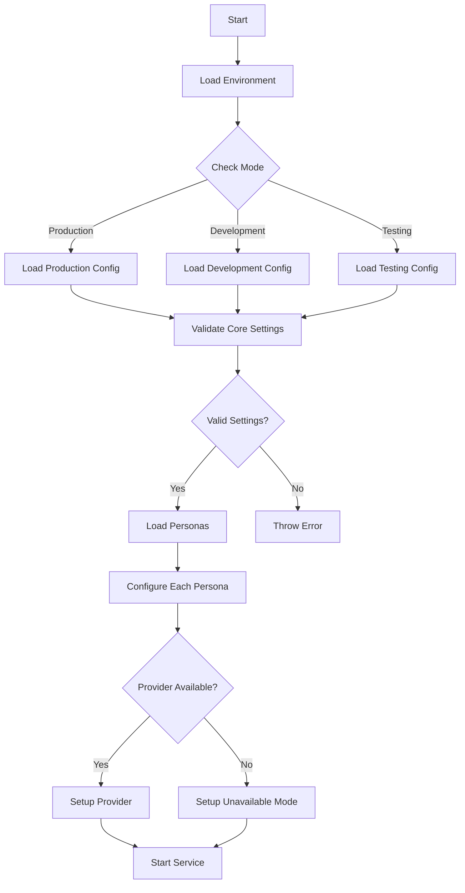
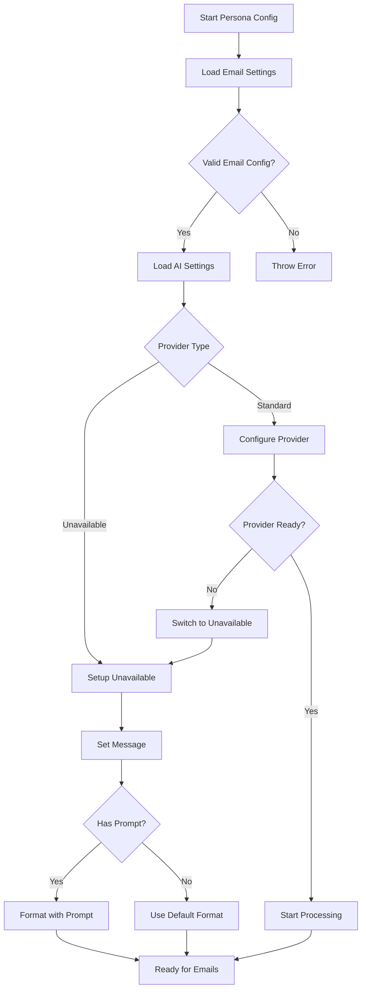
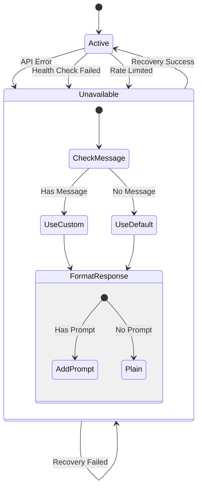

# MailAI Configuration Guide

This guide explains how to configure MailAI for your email processing needs. MailAI uses environment variables for configuration, supporting both single and multi-persona setups.

## Table of Contents
- [Core Configuration](#core-configuration)
- [Persona Configuration](#persona-configuration)
- [AI Provider Configuration](#ai-provider-configuration)
- [Advanced Options](#advanced-options)
- [Examples](#examples)
- [Configuration Flows](#configuration-flows)

## Core Configuration

Core settings use uppercase and follow this pattern:
```bash
MAILAI_MODE=production    # Mode: production, development, testing, dry_run
MAILAI_LOG=info          # Log level: debug, info, warn, error
```

## Persona Configuration

Each persona is configured using the pattern `MAILAI_{PERSONA}_*`. The persona ID preserves its case.

### Required Fields
```bash
MAILAI_{PERSONA}_email_user=user@example.com
MAILAI_{PERSONA}_email_password=app_specific_password
MAILAI_{PERSONA}_email_imap=imap.example.com
```

### Optional Fields
```bash
MAILAI_{PERSONA}_email_port=993
MAILAI_{PERSONA}_marking=[AI]  # Response marking
```

## AI Provider Configuration

AI settings use lowercase AI provider names and follow this pattern:
```bash
MAILAI_{PERSONA}_ai=openai    # AI provider: openai, claude, mistral
MAILAI_{PERSONA}_api_key=sk_... # API key for the AI provider
```

### Unavailable Mode
When an AI provider is unavailable, use this configuration:
```bash
# Set provider as unavailable
MAILAI_{PERSONA}_ai=unavailable

# Optional: Custom unavailable message
MAILAI_{PERSONA}_unavailable_message=Service temporarily down

# Optional: Custom prompt to include
MAILAI_{PERSONA}_prompt=AI agent, Institut Mariani
```

## Advanced Options

### Email Processing
```bash
MAILAI_{PERSONA}_batch_size=10      # Number of emails to process at once
MAILAI_{PERSONA}_retry_count=3      # Number of retries for failed operations
MAILAI_{PERSONA}_retry_delay=5000   # Delay between retries (ms)
```

### Rate Limiting
```bash
MAILAI_{PERSONA}_rate_limit=60      # Requests per minute
MAILAI_{PERSONA}_cooldown=1000      # Cooldown between requests (ms)
```

### Monitoring
```bash
MAILAI_{PERSONA}_health_check=true  # Enable health checking
MAILAI_{PERSONA}_metrics=true       # Enable metrics collection
```

## Examples

### Single Persona Setup
```bash
# Core Settings
MAILAI_MODE=production
MAILAI_LOG=info

# Persona Configuration
MAILAI_MyPersona_email_user=user@example.com
MAILAI_MyPersona_email_password=app_password
MAILAI_MyPersona_email_imap=imap.example.com
MAILAI_MyPersona_marking=[AI]

# AI Configuration
MAILAI_MyPersona_ai=openai
MAILAI_MyPersona_api_key=sk_...
```

### Multi-Persona Setup
```bash
# Core Settings
MAILAI_MODE=production
MAILAI_LOG=info

# First Persona
MAILAI_Work_email_user=work@company.com
MAILAI_Work_email_password=work_password
MAILAI_Work_email_imap=imap.company.com
MAILAI_Work_ai=claude
MAILAI_Work_api_key=sk_...

# Second Persona (Unavailable Mode)
MAILAI_Personal_email_user=me@example.com
MAILAI_Personal_email_password=personal_password
MAILAI_Personal_email_imap=imap.example.com
MAILAI_Personal_ai=unavailable
MAILAI_Personal_unavailable_message=Service temporarily down
MAILAI_Personal_prompt=AI assistant
```

## Configuration Flows

### Basic Configuration Flow


### Persona Configuration Flow


### Provider State Flow


## Best Practices

1. **Security**
   - Use app-specific passwords for email accounts
   - Never commit .env files to version control
   - Rotate API keys regularly

2. **Configuration**
   - Follow case conventions strictly
   - Use descriptive persona IDs
   - Keep unavailable messages user-friendly

3. **Monitoring**
   - Enable health checks in production
   - Configure appropriate log levels
   - Set up alerts for critical errors

4. **Performance**
   - Adjust batch sizes based on load
   - Configure rate limits appropriately
   - Use cooldown periods when needed

## Troubleshooting

Common configuration issues and solutions:

1. **Case Sensitivity**
   - Core settings must be uppercase
   - Provider names must be lowercase
   - Persona IDs preserve their case

2. **Connection Issues**
   - Verify IMAP settings
   - Check app-specific password
   - Confirm port numbers

3. **AI Provider Problems**
   - Validate API keys
   - Check provider status
   - Consider using unavailable mode

4. **Performance Issues**
   - Adjust batch sizes
   - Modify rate limits
   - Review retry settings
