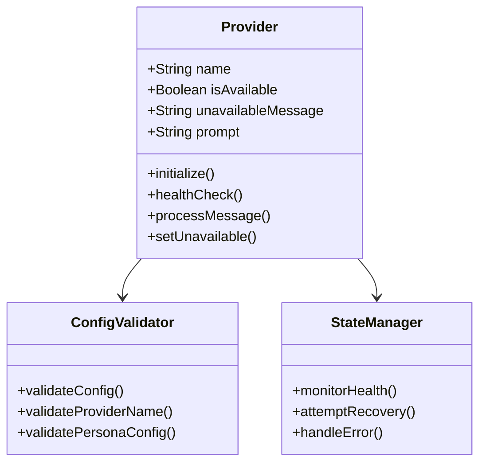
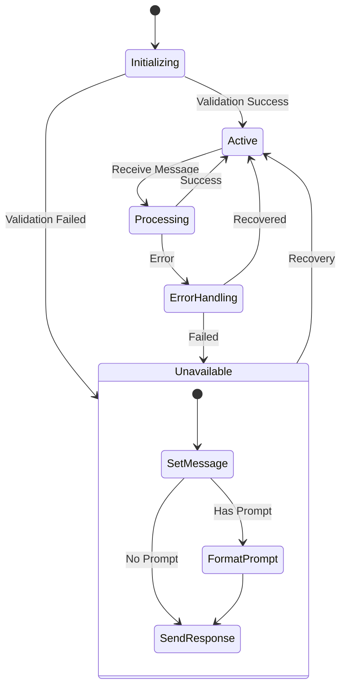
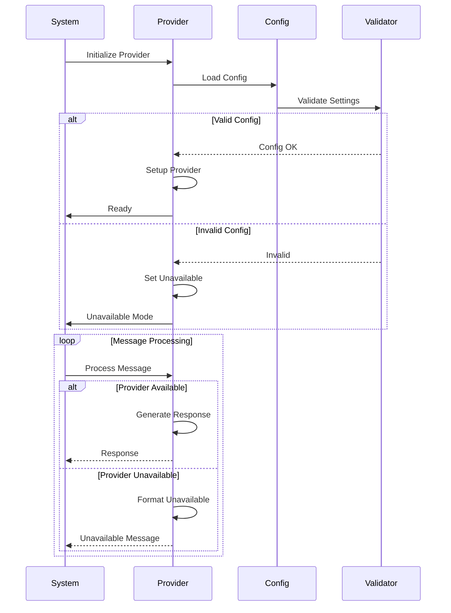
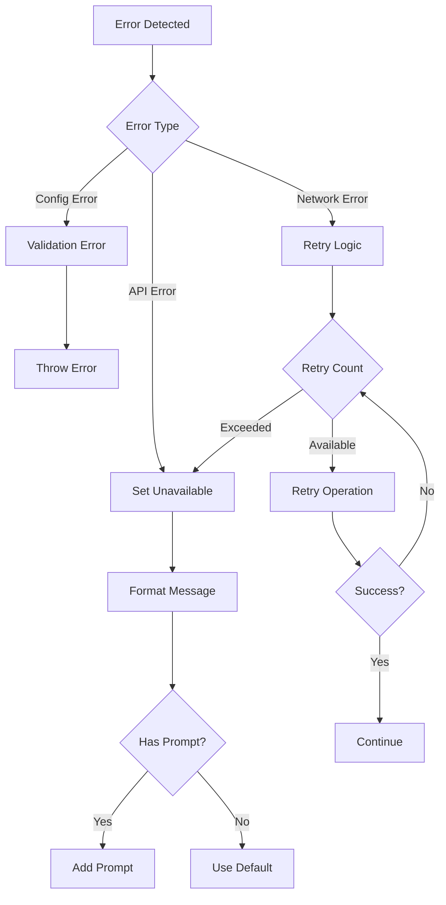
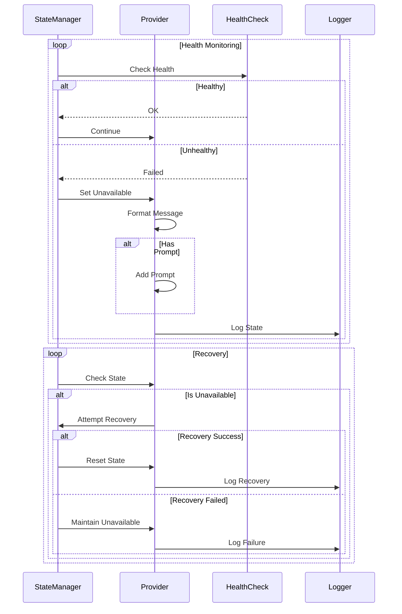

# MailAI Plugin Development Guide

This guide explains how to develop plugins for MailAI, particularly focusing on AI provider integration and handling unavailable states.

## Table of Contents
- [Plugin Architecture](#plugin-architecture)
- [Provider Integration](#provider-integration)
- [Configuration Standards](#configuration-standards)
- [State Management](#state-management)
- [Testing Guidelines](#testing-guidelines)

## Plugin Architecture

### Basic Structure
```javascript
class MyProvider {
    constructor(config) {
        this.name = 'myprovider';  // Must be lowercase
        this.config = config;
        this.isAvailable = true;
    }

    async initialize() {
        // Setup and validation
    }

    async processMessage(content) {
        // Message processing logic
    }
}
```

### Required Methods
```javascript
class MyProvider {
    // Check provider health
    async healthCheck() {
        try {
            // Perform health check
            return { status: 'healthy' };
        } catch (error) {
            return { status: 'unhealthy', error };
        }
    }

    // Handle unavailable state
    async setUnavailable(message, prompt) {
        this.isAvailable = false;
        this.unavailableMessage = message;
        this.prompt = prompt;
    }

    // Generate response
    async generateResponse(email) {
        if (!this.isAvailable) {
            return this.formatUnavailableResponse(email);
        }
        // Normal response generation
    }
}
```

## Plugin Architecture Diagrams

### Component Structure


### Plugin Lifecycle


### Provider Integration Flow


### Error Handling Flow


### State Management Flow


## Provider Integration

### Configuration Handling
```javascript
class MyProvider {
    validateConfig(config) {
        // Required fields
        const required = ['api_key'];
        for (const field of required) {
            if (!config[field]) {
                throw new Error(`Missing required field: ${field}`);
            }
        }

        // Optional fields
        this.unavailableMessage = config.unavailable_message;
        this.prompt = config.prompt;
    }

    formatUnavailableResponse(email) {
        const message = this.unavailableMessage || 'Service temporarily unavailable';
        const prompt = this.prompt ? `[${this.prompt}]` : '';
        return `${prompt} ${message}`;
    }
}
```

### Error Handling
```javascript
class MyProvider {
    async handleError(error) {
        if (this.isApiError(error)) {
            await this.setUnavailable(
                'API service unavailable',
                this.prompt
            );
            return this.formatUnavailableResponse();
        }
        throw error;
    }

    isApiError(error) {
        return error.code === 'API_ERROR' ||
               error.status === 503;
    }
}
```

## Configuration Standards

### Environment Variables
```javascript
class MyProvider {
    static getConfigFromEnv(persona) {
        return {
            // AI provider name must be lowercase
            ai: process.env[`MAILAI_${persona}_ai`]?.toLowerCase(),
            api_key: process.env[`MAILAI_${persona}_api_key`],
            // Optional fields
            unavailable_message: process.env[`MAILAI_${persona}_unavailable_message`],
            prompt: process.env[`MAILAI_${persona}_prompt`]
        };
    }
}
```

### Validation Rules
```javascript
class MyProvider {
    validateProviderName(name) {
        if (name !== name.toLowerCase()) {
            throw new Error('Provider name must be lowercase');
        }
    }

    validatePersonaConfig(persona, config) {
        // Persona ID preserves case
        if (!persona || !config) {
            throw new Error('Invalid configuration');
        }
    }
}
```

## State Management

### Health Monitoring
```javascript
class MyProvider {
    async monitorHealth() {
        try {
            const status = await this.healthCheck();
            if (status.status === 'unhealthy') {
                await this.setUnavailable(
                    'Service health check failed',
                    this.prompt
                );
            }
        } catch (error) {
            await this.handleError(error);
        }
    }
}
```

### Recovery Handling
```javascript
class MyProvider {
    async attemptRecovery() {
        try {
            await this.initialize();
            this.isAvailable = true;
            return true;
        } catch (error) {
            await this.handleError(error);
            return false;
        }
    }
}
```

## Testing Guidelines

### Test Cases
```javascript
describe('MyProvider', () => {
    test('handles unavailable state correctly', () => {
        const provider = new MyProvider(config);
        provider.setUnavailable('Down for maintenance', 'Test AI');
        
        const response = provider.formatUnavailableResponse();
        expect(response).toBe('[Test AI] Down for maintenance');
    });

    test('validates provider name case', () => {
        expect(() => {
            new MyProvider({ provider: 'MyProvider' })
        }).toThrow('Provider name must be lowercase');
    });
});
```

### Configuration Testing
```javascript
describe('Configuration', () => {
    test('preserves persona case', () => {
        const config = MyProvider.getConfigFromEnv('MyPersona');
        expect(config.ai).toBe('myprovider');
    });

    test('handles missing optional fields', () => {
        const provider = new MyProvider(minimalConfig);
        expect(provider.unavailableMessage).toBe(undefined);
        expect(provider.prompt).toBe(undefined);
    });
});
```

## Best Practices

1. **Provider Implementation**
   - Always implement unavailable state handling
   - Use lowercase provider names
   - Include health check mechanism

2. **Configuration**
   - Follow case sensitivity rules
   - Validate all required fields
   - Handle optional fields gracefully

3. **Error Handling**
   - Implement comprehensive error handling
   - Use appropriate unavailable messages
   - Include prompts when configured

4. **Testing**
   - Test all configuration scenarios
   - Verify unavailable state behavior
   - Check case sensitivity rules

## Example Implementation

Here's a complete example of a basic provider plugin:

```javascript
class ExampleProvider {
    constructor(config) {
        this.name = 'example';
        this.validateConfig(config);
        this.initialize();
    }

    validateConfig(config) {
        if (!config.api_key) {
            throw new Error('API key required');
        }
        this.config = config;
        this.unavailableMessage = config.unavailable_message;
        this.prompt = config.prompt;
    }

    async initialize() {
        try {
            await this.healthCheck();
        } catch (error) {
            await this.setUnavailable(
                'Failed to initialize',
                this.prompt
            );
        }
    }

    async generateResponse(email) {
        if (!this.isAvailable) {
            return this.formatUnavailableResponse(email);
        }
        try {
            // Actual response generation
            return response;
        } catch (error) {
            return this.handleError(error);
        }
    }
}
```
